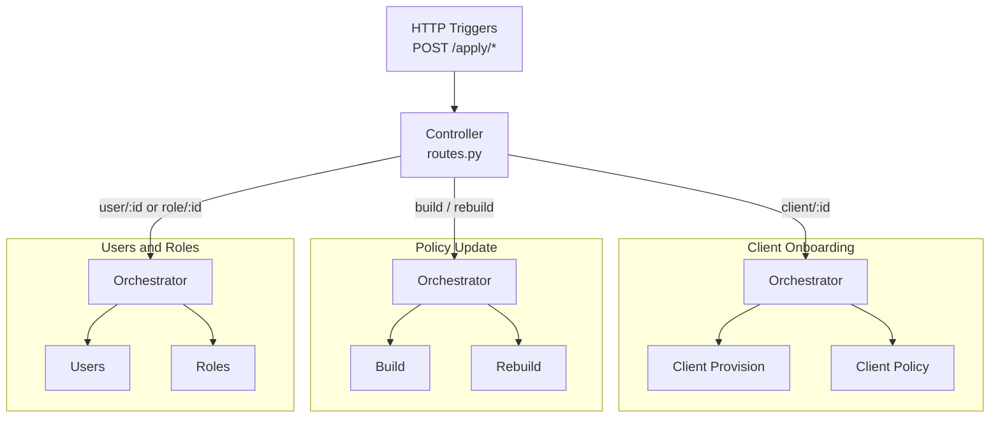
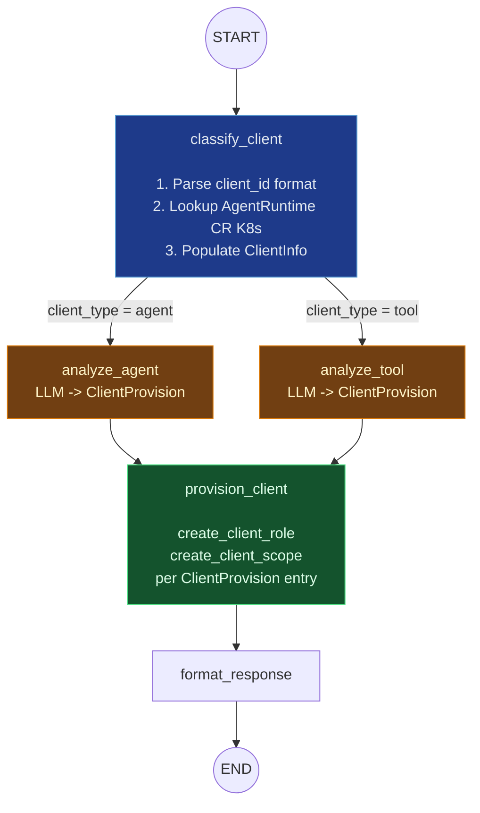
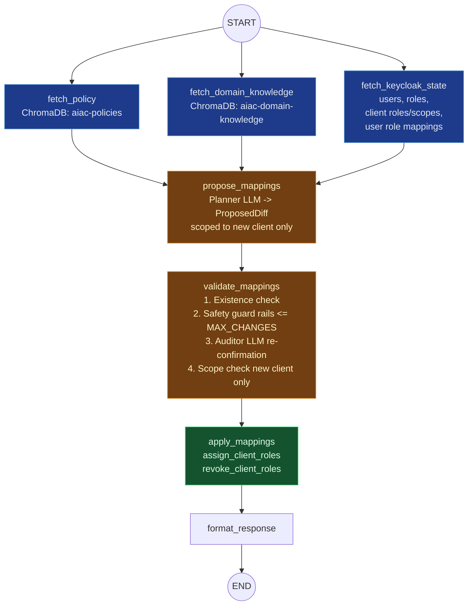
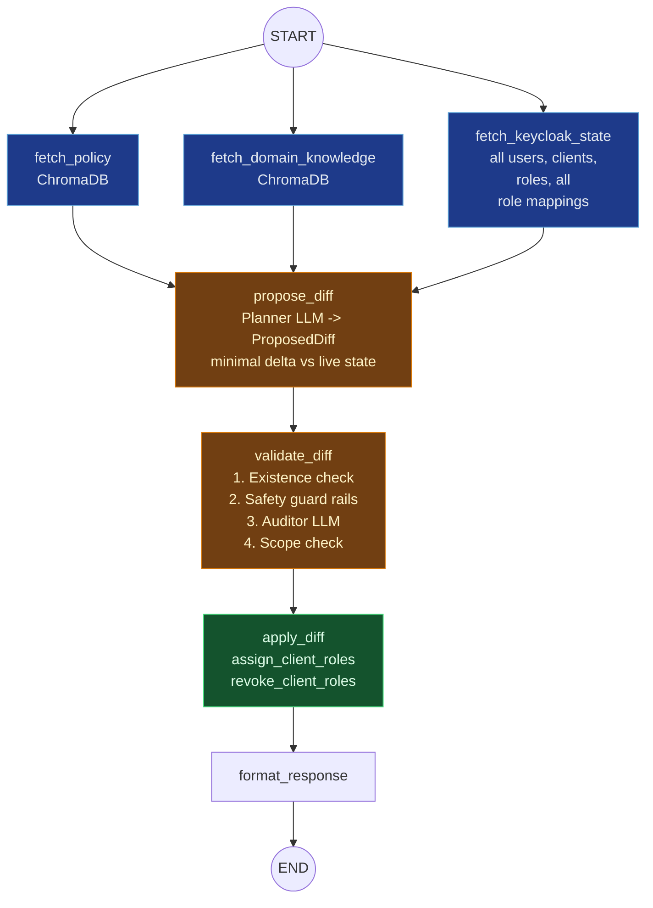
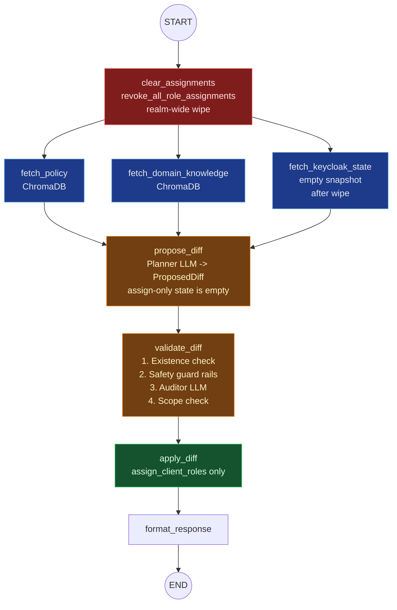
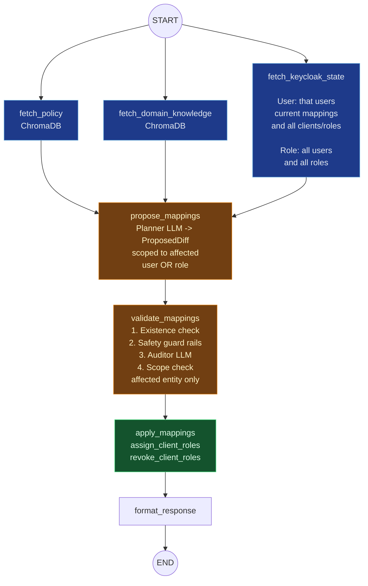
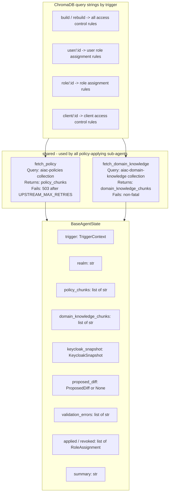
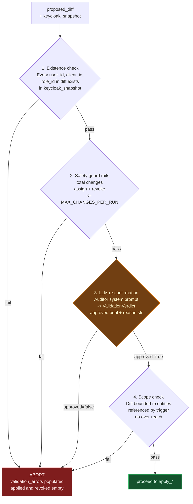

# AIAC Agent — Visual Diagrams

## 1. Top-Level Architecture

---

## 2. Client Onboarding Sub-agents

### 2a. Client Provision

**State:** `OnboardingProvisionState` — adds `client_info: ClientInfo | None` and `client_provision: ClientProvision | None` to `BaseAgentState`.

### 2b. Client Policy

**State:** `BaseAgentState` (no extensions).

---

## 3. Policy Update Sub-agents

### 3a. Build

### 3b. Rebuild

**Rebuild differs from Build only by the `clear_assignments` node before the fan-out.**

---

## 4. Users & Roles Sub-agents

Both sub-agents share the same graph shape; only `fetch_keycloak_state` scope differs.

---

## 5. Shared Module

---

## 6. Validate Node — Common Checks

All `validate_*` nodes execute the same four checks (binary abort on any failure):

