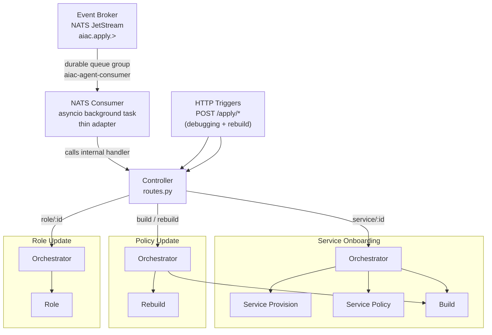
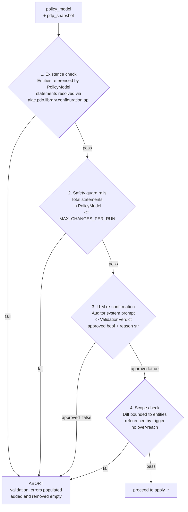

# Component PRD: AIAC Agent

## Description

A LangGraph-based AI agent service that enforces a natural-language access control policy against the live PDP state. Triggered via the **Event Broker** (NATS JetStream) for all automated triggers, and directly via HTTP for the operator-only `rebuild` command:

- **Event Broker** → `aiac.apply.service.{id}` subject (originated by Keycloak SPI `CLIENT_CREATED`)
- **Event Broker** → `aiac.apply.role.{id}` subject (originated by Keycloak SPI role created/updated)
- **Event Broker** → `aiac.apply.policy.build` subject (originated by RAG Ingest Service post-ingest)
- **Operator/admin call** → `POST /apply/policy/rebuild` directly via `kubectl port-forward` (HTTP only — not routed through Event Broker)

The Agent subscribes to the Event Broker as a durable competing consumer (`aiac-agent-consumer` queue group). It acknowledges each message only after successful processing — ensuring at-least-once delivery and automatic replay on pod restart.

The `/apply/*` HTTP endpoints are retained as a debugging escape hatch. The **NATS consumer is a thin adapter layer** that receives events from the Event Broker and calls the same internal `/apply/*` handler functions — there is no duplicated business logic.

The service is structured as a **Controller** (FastAPI routes) that dispatches to three **Orchestrators**, each owning one or more compiled `StateGraph` sub-agents:

| Orchestrator | Trigger(s) | Sub-agents |
|---|---|---|
| Service Onboarding | `service/{id}` | Service Provision → Service Policy → Policy Apply (sequential) |
| Policy Update | `build`, `rebuild` | Build sub-agent or Rebuild sub-agent (alternative) |
| Role Update | `role/{id}` | Role sub-agent |

All components are **logically separated modules within a single pod and process** — no inter-service network calls between orchestrators and sub-agents.



---

## NATS Consumer

A thin adapter started as an **asyncio background task** in the FastAPI `lifespan` handler. It subscribes to the `aiac.apply.>` wildcard on the `aiac-events` NATS JetStream stream using the `aiac-agent-consumer` durable queue group.

### Dispatch table

| Subject pattern | Internal handler |
|---|---|
| `aiac.apply.service.{id}` | Service Onboarding Orchestrator |
| `aiac.apply.role.{id}` | Role Update Orchestrator |
| `aiac.apply.policy.build` | Policy Update Orchestrator (Build) |

### Ack contract

The consumer **awaits** the internal handler before issuing the NATS acknowledgement. On handler success → ack. On handler exception → do not ack; NATS redelivers after `AckWait`. After 5 unacknowledged redeliveries, NATS routes the message to `aiac.apply.dlq`.

Fire-and-forget (`asyncio.create_task`) is explicitly prohibited — acking before handler completion would break at-least-once guarantees.

### Failure isolation

The consumer and the FastAPI HTTP server share the same process. If the Agent pod crashes mid-processing, the in-flight message was never acked and NATS redelivers it to the next pod instance. This prevents the consumer from exhausting retry counts against an unavailable handler (which would occur if they were separate containers).

### Configuration

| Variable | Default | Source |
|---|---|---|
| `NATS_URL` | `nats://aiac-event-broker-service:4222` | ConfigMap (`aiac-pdp-config`) |

---

## Controller

The Controller is a thin FastAPI routes layer (`controller/routes.py`). Its sole responsibilities are:

- Parse the trigger type and entity ID from the request path.
- Dispatch to the appropriate orchestrator.
- Return the orchestrator's response to the caller.

No business logic, retry handling, or state assembly lives in the Controller.

---

## Use Cases

Each orchestrator and its sub-agents are specified in a dedicated sub-PRD:

| Use Case | Sub-PRD | Trigger(s) |
|---|---|---|
| Service Onboarding | [aiac-agent/uc1-service-onboarding.md](aiac-agent/uc1-service-onboarding.md) | `aiac.apply.service.{id}`, `POST /apply/service/{id}` |
| Policy Update | [aiac-agent/uc2-policy-update.md](aiac-agent/uc2-policy-update.md) | `aiac.apply.policy.build`, `POST /apply/policy/build`, `POST /apply/policy/rebuild` |
| Role Update | [aiac-agent/uc3-role-update.md](aiac-agent/uc3-role-update.md) | `aiac.apply.role.{id}`, `POST /apply/role/{id}` |

---

## Shared Module

Lives at `aiac/src/aiac/agent/shared/`.


### `shared/nodes.py`

Two node functions shared by all policy-applying sub-agents:

- `fetch_policy`: queries `aiac-policies` ChromaDB collection; stores results in `BaseAgentState.policy_chunks`. Returns `503` when ChromaDB is unavailable after `UPSTREAM_MAX_RETRIES` retries.
- `fetch_domain_knowledge`: queries `aiac-domain-knowledge` ChromaDB collection; stores results in `BaseAgentState.domain_knowledge_chunks`. Returns `[]` when collection is empty — non-fatal.

Both nodes use the same trigger-type-keyed query strings:

| Trigger | ChromaDB similarity query |
|---|---|
| `build` | `"all access control rules"` |
| `rebuild` | `"all access control rules"` |
| `role/{id}` | `"role assignment rules"` |
| `service/{id}` | `"service access control rules"` |

Number of results capped by `CHROMA_N_RESULTS` (default `10`).

### `shared/state.py`

All type definitions shared across agents:

#### `BaseAgentState`

| Field | Type | Description |
|---|---|---|
| `trigger` | `TriggerContext` | Endpoint type + entity ID |
| `realm` | `str` | Realm name (from `KEYCLOAK_REALM`) |
| `policy_chunks` | `list[str]` | Policy text chunks from `aiac-policies` |
| `domain_knowledge_chunks` | `list[str]` | Domain context chunks from `aiac-domain-knowledge` |
| `pdp_snapshot` | `PDPSnapshot` | Scoped PDP data for this trigger |
| `policy_model` | `PolicyModel \| None` | Validated policy to commit; produced by policy-proposing sub-agents |
| `validation_errors` | `list[str]` | Errors from validate node |
| `added` | `list[CompositeMapping]` | Executed composite additions |
| `removed` | `list[CompositeMapping]` | Executed composite removals |
| `summary` | `str` | Human-readable explanation |

#### `PDPSnapshot`

```python
class PDPSnapshot(BaseModel):
    subjects: list[Subject] = []
    roles: list[Role] = []
    services: list[Service] = []
    service_permissions: dict[str, list[Permission]] = {}  # service_id → permissions
    service_scopes: list[Scope] = []
    subject_assignments: dict[str, Assignments] = {}       # subject_id → assignments
    role_composites: dict[str, list[Permission]] = {}      # role_name → current composite permissions
```

#### `PolicyModel`

Produced by `propose_policy` / `validate_policy` nodes in all policy-proposing sub-agents; consumed by the shared Policy Apply sub-agent. Committed to the PDP Policy Service via `aiac.pdp.library.policy.api.apply_policy(PolicyModel)`. The PDP Policy Service handles translation to the appropriate backend format (Keycloak composite mappings or Rego rules).

`PolicyModel` is defined in `aiac/pdp/library/policy/models.py`. `PolicyStatement` shape is TBD — must carry sufficient information for entity existence resolution via `aiac.pdp.library.configuration.api`.

#### `ValidationVerdict`

```python
class ValidationVerdict(BaseModel):
    approved: bool
    reason: str
```

Service Onboarding types (`ServiceType`, `RoleDefinition`, `ScopeDefinition`, `ServiceProvision`, `OnboardingProvisionState`) are defined in `onboarding/provision/state.py`. `PolicyModel` and `PolicyStatement` are defined in `aiac/pdp/library/policy/models.py`. See [UC1: Service Onboarding](aiac-agent/uc1-service-onboarding.md).

---

## LLM Integration

All `propose_*` and `validate_*` nodes use `langchain-openai` (`ChatOpenAI`) via `llm.with_structured_output()`. Target endpoint must support tool calling.

Each sub-agent defines its own `PLANNER_SYSTEM` and `AUDITOR_SYSTEM` constants in its `prompts.py`:

- **Planner prompt**: system message (stable, cacheable) — role definition + `AIAC_AC_MODEL` framing scoped to the agent's context; user message (per-request) — trigger description + policy chunks + domain knowledge section + scoped PDP snapshot summary.
- **Auditor prompt**: system message — auditor role for the specific agent's scope; user message — proposed diff + policy chunks + domain knowledge chunks.

---

## Validate Node — Common Checks (All Agents)

All `validate_*` / `validate_mappings` nodes perform the same four checks. Binary abort on any failure:



1. **Existence check** — all entities referenced by `PolicyModel` statements exist; resolved via `aiac.pdp.library.configuration.api`.
2. **Safety guard rails** — total statements in `PolicyModel` ≤ `MAX_CHANGES_PER_RUN`.
3. **LLM re-confirmation** — second LLM call with auditor system prompt; returns `ValidationVerdict(approved, reason)`.
4. **Scope check** — `PolicyModel` is bounded to entities referenced by the trigger; no over-reach on partial updates.

---

## Endpoints

| Method | Path | Orchestrator | Sub-agent |
|---|---|---|---|
| POST | `/apply/policy/build` | Policy Update | Build |
| POST | `/apply/policy/rebuild` | Policy Update | Rebuild |
| POST | `/apply/role/{role_id}` | Role Update | Role |
| POST | `/apply/service/{service_id}` | Service Onboarding | Provision → Policy |

**Success response (Service Onboarding):**
```json
{ "added": [...], "removed": [...], "summary": "...", "provisioned": { "roles": [...], "scopes": [...] } }
```

**Success response (all other agents):**
```json
{ "added": [...], "removed": [...], "summary": "...", "provisioned": null }
```

**Abort response (validation failure, all agents):**
```json
{ "added": [], "removed": [], "summary": "...", "validation_errors": [...], "provisioned": null }
```

---

## Configuration

| Variable | Default | Source |
|---|---|---|
| `NATS_URL` | `nats://aiac-event-broker-service:4222` | ConfigMap (`aiac-pdp-config`) |
| `AIAC_PDP_CONFIG_URL` | `http://aiac-pdp-config-service:7071` | ConfigMap (`aiac-pdp-config`) |
| `AIAC_PDP_POLICY_URL` | `http://aiac-pdp-policy-service:7072` | ConfigMap (`aiac-pdp-config`) |
| `AIAC_CHROMADB_URL` | `http://aiac-rag-service:8000` | ConfigMap (`aiac-pdp-config`) |
| `KEYCLOAK_REALM` | — | ConfigMap (`aiac-pdp-config`) |
| `LLM_BASE_URL` | — | ConfigMap |
| `LLM_MODEL` | — | ConfigMap |
| `LLM_API_KEY` | — | Kubernetes Secret |
| `AIAC_AC_MODEL` | `RBAC` | ConfigMap (accepted: `RBAC`, `ABAC`, `REBAC`) |
| `CHROMA_N_RESULTS` | `10` | ConfigMap |
| `MAX_CHANGES_PER_RUN` | `50` | ConfigMap |
| `UPSTREAM_MAX_RETRIES` | `3` | ConfigMap |

ChromaDB collections: `aiac-policies` and `aiac-domain-knowledge`.

---

## Error Handling

All upstream calls are retried up to `UPSTREAM_MAX_RETRIES` times with exponential backoff (`tenacity`) before propagating the error.

| Upstream | HTTP status on final failure |
|---|---|
| ChromaDB | `503 Service Unavailable` |
| PDP Configuration Service | `502 Bad Gateway` |
| PDP Policy Service | `502 Bad Gateway` |
| Kubernetes API | `502 Bad Gateway` |
| LLM API | `504 Gateway Timeout` |

---

## Runtime

- Framework: FastAPI with uvicorn
- Bind: `0.0.0.0:7070`
- State: stateless — changes applied immediately, no pending session required
- Base image: `python:3.12-slim`

---

## File Structure

```
aiac/src/aiac/agent/
├── controller/
│   ├── __init__.py
│   └── routes.py                        ← FastAPI app + four route handlers
│
├── onboarding/
│   ├── __init__.py
│   ├── orchestrator.py                  ← sequences provision → policy → apply, assembles combined response
│   ├── provision/
│   │   ├── __init__.py
│   │   ├── graph.py                     ← Service Provision StateGraph
│   │   ├── nodes.py                     ← classify_service, analyze_agent, analyze_tool, provision_service, format_response
│   │   └── state.py                     ← ServiceType, RoleDefinition, ScopeDefinition, ServiceProvision, OnboardingProvisionState
│   └── policy/
│       ├── __init__.py
│       ├── graph.py                     ← Service Policy StateGraph
│       ├── nodes.py                     ← fetch_pdp_state, propose_policy, validate_policy
│       └── prompts.py                   ← PLANNER_SYSTEM, AUDITOR_SYSTEM
│
├── policy_update/
│   ├── __init__.py
│   ├── orchestrator.py                  ← dispatches to build or rebuild sub-agent
│   ├── build/
│   │   ├── __init__.py
│   │   ├── graph.py                     ← Build StateGraph
│   │   ├── nodes.py                     ← fetch_pdp_state, propose_diff, validate_diff, apply_diff, format_response
│   │   └── prompts.py                   ← PLANNER_SYSTEM, AUDITOR_SYSTEM
│   └── rebuild/
│       ├── __init__.py
│       ├── graph.py                     ← Rebuild StateGraph
│       ├── nodes.py                     ← clear_composites, fetch_pdp_state, propose_diff, validate_diff, apply_diff, format_response
│       └── prompts.py                   ← PLANNER_SYSTEM, AUDITOR_SYSTEM
│
├── roles/
│   ├── __init__.py
│   ├── orchestrator.py                  ← dispatches to role sub-agent
│   └── role/
│       ├── __init__.py
│       ├── graph.py                     ← Role StateGraph
│       ├── nodes.py                     ← fetch_pdp_state, propose_mappings, validate_mappings, apply_mappings, format_response
│       └── prompts.py                   ← PLANNER_SYSTEM, AUDITOR_SYSTEM
│
└── shared/
    ├── __init__.py
    ├── nodes.py                         ← fetch_policy, fetch_domain_knowledge
    ├── state.py                         ← BaseAgentState, TriggerContext, PDPSnapshot, PolicyModel, ValidationVerdict
    └── apply/
        ├── __init__.py
        ├── graph.py                     ← PolicyApplyGraph (shared by all policy-producing sub-agents)
        └── nodes.py                     ← apply_policy, format_response
```

Docker build command (run from repo root):

```bash
docker build -f aiac/src/aiac/agent/controller/Dockerfile \
             -t aiac-agent:latest \
             aiac/src/
```

---

## Dependencies (`requirements.txt`)

```
langgraph
langchain-openai
chromadb
tenacity
fastapi
uvicorn[standard]
requests
python-dotenv
kubernetes
nats-py
```
