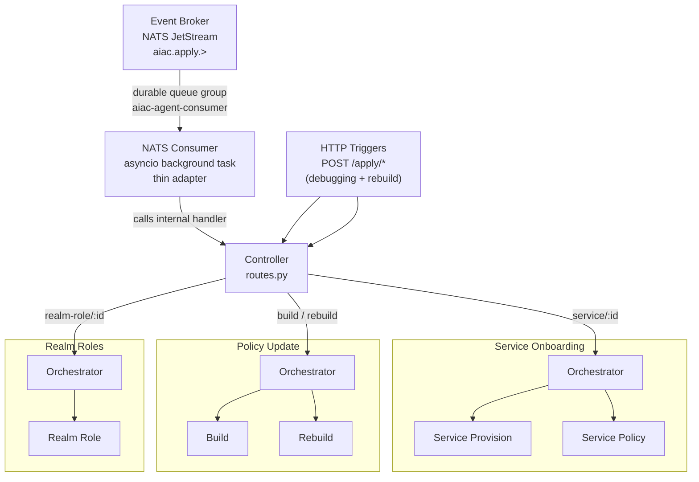
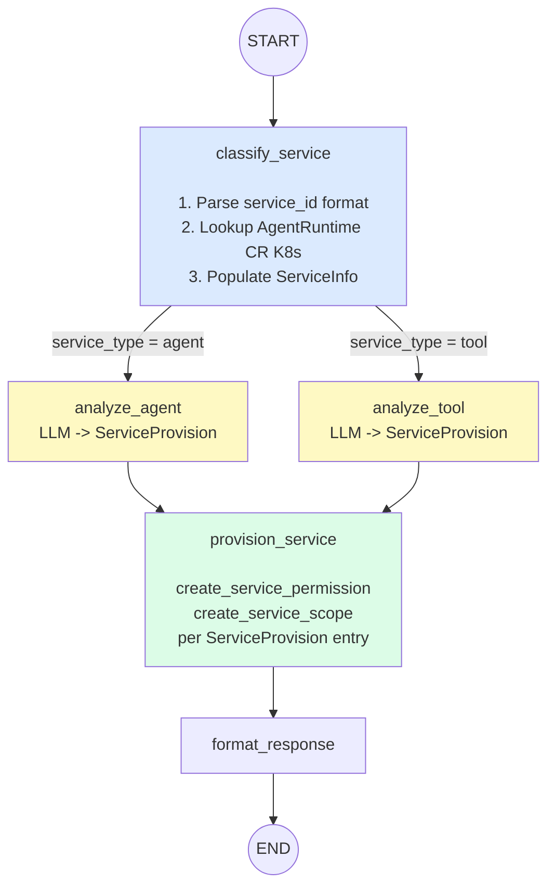
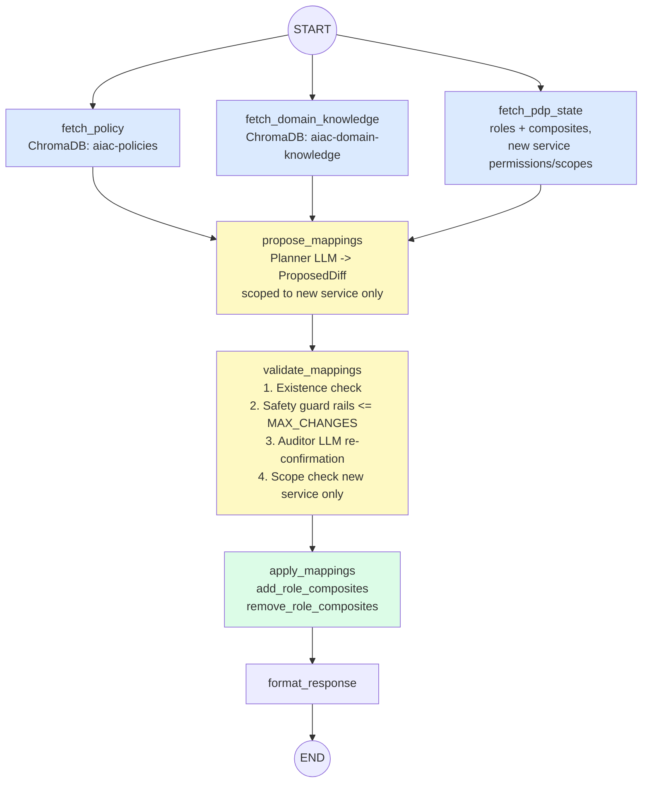
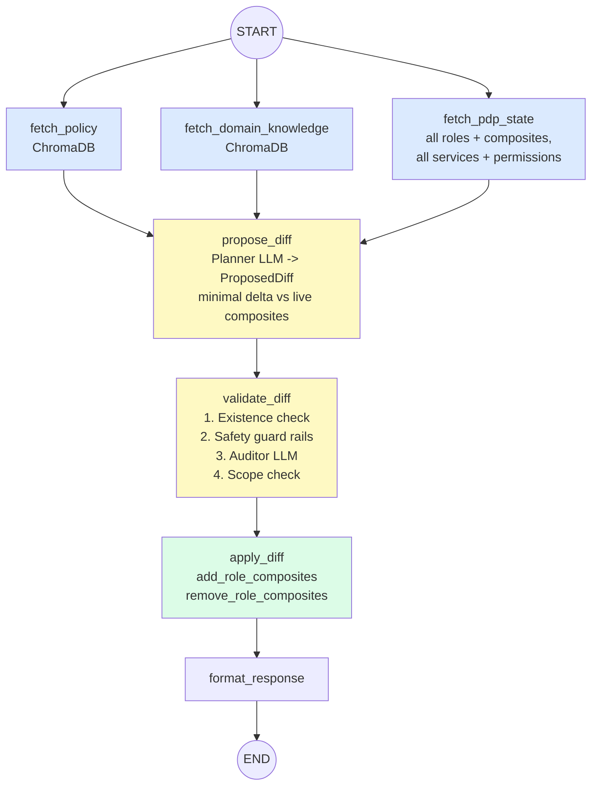
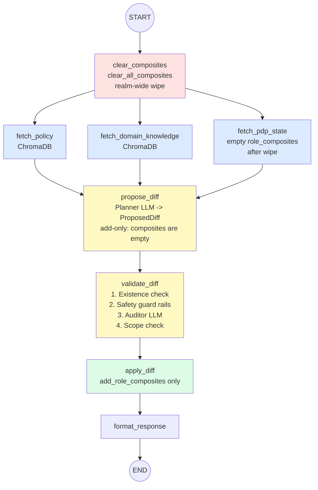
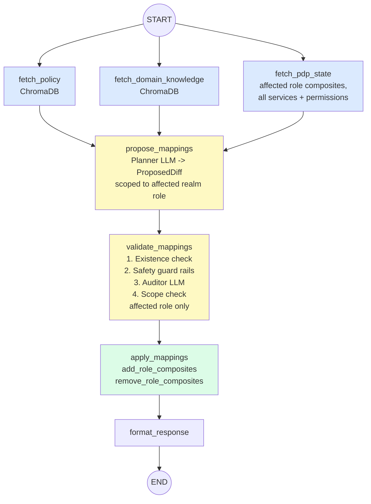
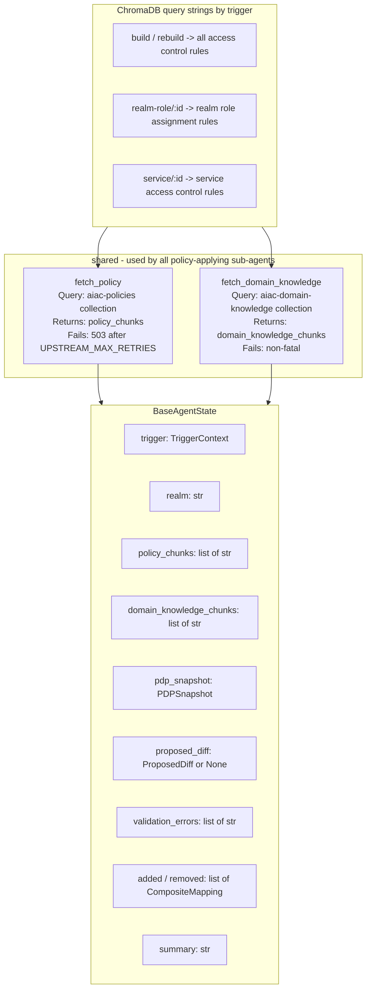
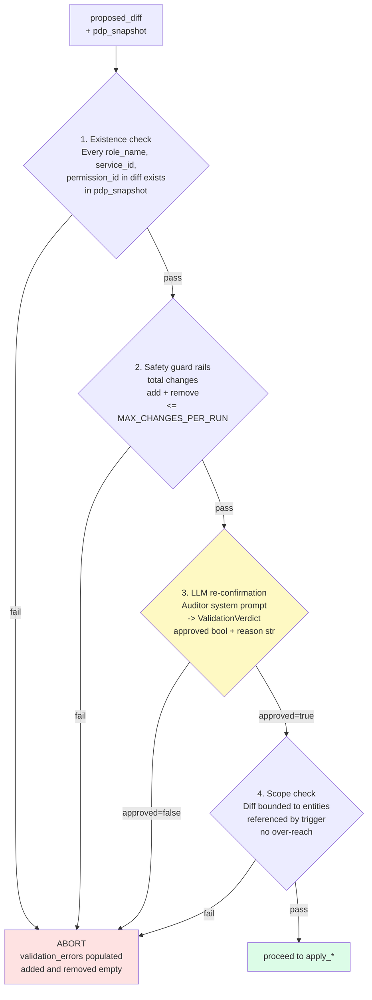

# Component PRD: AIAC Agent

## Description

A LangGraph-based AI agent service that enforces a natural-language access control policy against the live PDP state. Triggered via the **Event Broker** (NATS JetStream) for all automated triggers, and directly via HTTP for the operator-only `rebuild` command:

- **Event Broker** → `aiac.apply.service.{id}` subject (originated by Keycloak SPI `CLIENT_CREATED`)
- **Event Broker** → `aiac.apply.realm-role.{id}` subject (originated by Keycloak SPI realm role created/updated)
- **Event Broker** → `aiac.apply.build` subject (originated by RAG Ingest Service post-ingest)
- **Operator/admin call** → `POST /apply/rebuild` directly via `kubectl port-forward` (HTTP only — not routed through Event Broker)

The Agent subscribes to the Event Broker as a durable competing consumer (`aiac-agent-consumer` queue group). It acknowledges each message only after successful processing — ensuring at-least-once delivery and automatic replay on pod restart.

The `/apply/*` HTTP endpoints are retained as a debugging escape hatch. The **NATS consumer is a thin adapter layer** that receives events from the Event Broker and calls the same internal `/apply/*` handler functions — there is no duplicated business logic.

The service is structured as a **Controller** (FastAPI routes) that dispatches to three **Orchestrators**, each owning one or more compiled `StateGraph` sub-agents:

| Orchestrator | Trigger(s) | Sub-agents |
|---|---|---|
| Service Onboarding | `service/{id}` | Service Provision → Service Policy (sequential) |
| Policy Update | `build`, `rebuild` | Build sub-agent or Rebuild sub-agent (alternative) |
| Realm Roles | `realm-role/{id}` | Realm Role sub-agent |

All components are **logically separated modules within a single pod and process** — no inter-service network calls between orchestrators and sub-agents.



---

## NATS Consumer

A thin adapter started as an **asyncio background task** in the FastAPI `lifespan` handler. It subscribes to the `aiac.apply.>` wildcard on the `aiac-events` NATS JetStream stream using the `aiac-agent-consumer` durable queue group.

### Dispatch table

| Subject pattern | Internal handler |
|---|---|
| `aiac.apply.service.{id}` | Service Onboarding Orchestrator |
| `aiac.apply.realm-role.{id}` | Realm Roles Orchestrator |
| `aiac.apply.build` | Policy Update Orchestrator (Build) |

### Ack contract

The consumer **awaits** the internal handler before issuing the NATS acknowledgement. On handler success → ack. On handler exception → do not ack; NATS redelivers after `AckWait`. After 5 unacknowledged redeliveries, NATS routes the message to `aiac.apply.dlq`.

Fire-and-forget (`asyncio.create_task`) is explicitly prohibited — acking before handler completion would break at-least-once guarantees.

### Failure isolation

The consumer and the FastAPI HTTP server share the same process. If the Agent pod crashes mid-processing, the in-flight message was never acked and NATS redelivers it to the next pod instance. This prevents the consumer from exhausting retry counts against an unavailable handler (which would occur if they were separate containers).

### Configuration

| Variable | Default | Source |
|---|---|---|
| `NATS_URL` | `nats://aiac-event-broker-service:4222` | ConfigMap (`aiac-pdp-config`) |

---

## Controller

The Controller is a thin FastAPI routes layer (`controller/routes.py`). Its sole responsibilities are:

- Parse the trigger type and entity ID from the request path.
- Dispatch to the appropriate orchestrator.
- Return the orchestrator's response to the caller.

No business logic, retry handling, or state assembly lives in the Controller.

---

## Service Onboarding Orchestrator

Handles `POST /apply/service/{service_id}`.

The orchestrator sequences two sub-agents and assembles the final response:

```
ServiceProvisionGraph.invoke() → ServicePolicyGraph.invoke() → assemble response
```

### Service Provision Sub-agent

```
START → classify_service → [analyze_agent | analyze_tool] → provision_service → format_response → END
```

- `classify_service`: determines service type and populates `ServiceInfo`.
  1. **Parse `trigger.service_id`**:
     - SPIFFE format `spiffe://{domain}/ns/{namespace}/sa/{serviceAccount}` → extract namespace.
     - Short format `{namespace}/{workloadName}` → split on first `/`.
     - Unrecognised format → treat as `ServiceType.tool`.
  2. **Look up `AgentRuntime` CR** (`agent.kagenti.dev/v1alpha1`) by namespace + name via the in-cluster Kubernetes API.
     - **Found** → `service_type = agent`: read the `AgentCard` CR; populate `ServiceInfo(service_type=agent, description=card.description, skills=[Skill(id, name, description) for each AgentSkill])`.
     - **Not found** → `service_type = tool`: call `get_services(realm)` from `aiac.pdp.library.configuration`; locate the `Service` by `service_id`; populate `ServiceInfo(service_type=tool, description=service.description or service.name, skills=[])`.
  3. Returns `502` on Kubernetes API failure or if the Service record is not found for a tool.

  > **Kubernetes API access:** The agent pod `ServiceAccount` requires `get`/`list` on `agentruntimes.agent.kagenti.dev` and `agentcards.agent.kagenti.dev`.

  > **kagenti-operator note:** The operator does not expose an HTTP API. `AgentCard` CRs (`agent.kagenti.dev/v1alpha1`) are stored alongside workloads. Absence of an `AgentRuntime` CR is the authoritative signal for `ServiceType.tool`.

- `analyze_agent` / `analyze_tool`: LLM node producing a `ServiceProvision` from `ServiceInfo`. Routing is a conditional edge on `ServiceInfo.service_type`.
- `provision_service`: non-LLM node; calls `create_service_permission` and `create_service_scope` from `aiac.pdp.library.policy` for each entry in `ServiceProvision`.
- `format_response`: assembles the provision result for the orchestrator.



**State:** `OnboardingProvisionState` extends `BaseAgentState` with:

| Field | Type | Description |
|---|---|---|
| `service_info` | `ServiceInfo \| None` | Populated by `classify_service` |
| `service_provision` | `ServiceProvision \| None` | Populated by `analyze_agent` or `analyze_tool` |

### Service Policy Sub-agent

Runs after Service Provision completes. Freshly provisioned permissions/scopes are live in Keycloak before this sub-agent starts.

```
START → [fetch_policy ‖ fetch_domain_knowledge ‖ fetch_pdp_state] → propose_mappings → validate_mappings → apply_mappings → format_response → END
```

- Examines all realm roles and determines which realm role → service permission/scope composite mappings to create for the newly added service, based on the access control policy and domain knowledge.
- `fetch_pdp_state`: fetches all realm roles and their current composites, the new service's permissions and scopes.
- `propose_mappings`: LLM node; produces `ProposedDiff` scoped to the new service only.
- `validate_mappings`: existence check + safety guard rails + auditor LLM re-confirmation + scope check (bounded to the new service).
- `apply_mappings`: calls `add_role_composites` / `remove_role_composites` from `aiac.pdp.library.policy` for each entry in the validated diff.
- `format_response`: assembles the policy result for the orchestrator.



**State:** `BaseAgentState` (no extensions required).

**Prompts** (`onboarding/policy/prompts.py`): `PLANNER_SYSTEM`, `AUDITOR_SYSTEM` — scoped to single-service composite mapping context.

---

## Policy Update Orchestrator

Handles `POST /apply/build` and `POST /apply/rebuild`. Dispatches to one sub-agent based on trigger type.

The Policy Update agent compares the **current composite role mappings** (authoritative record of previously applied rules) against the **current policy in ChromaDB** and applies the delta: adding missing composite mappings and removing stale ones.

### Build Sub-agent

```
START → [fetch_policy ‖ fetch_domain_knowledge ‖ fetch_pdp_state] → propose_diff → validate_diff → apply_diff → format_response → END
```

- `fetch_pdp_state`: fetches all realm roles and their current composites, all services and their permissions, all scopes.
- `propose_diff`: LLM node; produces `ProposedDiff` — minimal delta between ChromaDB policy and live composite state.
- `validate_diff`: existence check + safety guard rails + auditor LLM re-confirmation + scope check.
- `apply_diff`: calls `add_role_composites` / `remove_role_composites` from `aiac.pdp.library.policy`.
- `format_response`: assembles the build result.



**State:** `BaseAgentState` (no extensions required).

**Prompts** (`policy_update/build/prompts.py`): `PLANNER_SYSTEM`, `AUDITOR_SYSTEM`.

### Rebuild Sub-agent

```
START → clear_composites → [fetch_policy ‖ fetch_domain_knowledge ‖ fetch_pdp_state] → propose_diff → validate_diff → apply_diff → format_response → END
```

- `clear_composites`: calls `clear_all_composites(realm)` from `aiac.pdp.library.policy` before the fetch fan-out. Removes all composite mappings from all realm roles. `propose_diff` receives a `PDPSnapshot` with empty `role_composites` and produces an add-only diff.
- All other nodes: identical in contract to Build sub-agent.



**State:** `BaseAgentState` (no extensions required).

**Prompts** (`policy_update/rebuild/prompts.py`): `PLANNER_SYSTEM`, `AUDITOR_SYSTEM`.

---

## Realm Roles Orchestrator

Handles `POST /apply/realm-role/{role_id}`. Dispatches to the Realm Role sub-agent.

### Realm Role Sub-agent

```
START → [fetch_policy ‖ fetch_domain_knowledge ‖ fetch_pdp_state] → propose_mappings → validate_mappings → apply_mappings → format_response → END
```

- `fetch_pdp_state`: fetches all services and their permissions, all realm roles, and the current composites for the affected realm role.
- `propose_mappings`: LLM node; produces `ProposedDiff` scoped to the affected realm role.
- `validate_mappings`: existence check + safety guard rails + auditor LLM re-confirmation + scope check (bounded to the affected realm role).
- `apply_mappings`: calls `add_role_composites` / `remove_role_composites` from `aiac.pdp.library.policy`.
- `format_response`: assembles the result.



**State:** `BaseAgentState` (no extensions required).

**Prompts** (`realm_roles/realm_role/prompts.py`): `PLANNER_SYSTEM`, `AUDITOR_SYSTEM`.

---

## Shared Module

Lives at `aiac/src/aiac/agent/shared/`.



### `shared/nodes.py`

Two node functions shared by all policy-applying sub-agents:

- `fetch_policy`: queries `aiac-policies` ChromaDB collection; stores results in `BaseAgentState.policy_chunks`. Returns `503` when ChromaDB is unavailable after `UPSTREAM_MAX_RETRIES` retries.
- `fetch_domain_knowledge`: queries `aiac-domain-knowledge` ChromaDB collection; stores results in `BaseAgentState.domain_knowledge_chunks`. Returns `[]` when collection is empty — non-fatal.

Both nodes use the same trigger-type-keyed query strings:

| Trigger | ChromaDB similarity query |
|---|---|
| `build` | `"all access control rules"` |
| `rebuild` | `"all access control rules"` |
| `realm-role/{id}` | `"realm role assignment rules"` |
| `service/{id}` | `"service access control rules"` |

Number of results capped by `CHROMA_N_RESULTS` (default `10`).

### `shared/state.py`

All type definitions shared across agents:

#### `BaseAgentState`

| Field | Type | Description |
|---|---|---|
| `trigger` | `TriggerContext` | Endpoint type + entity ID |
| `realm` | `str` | Realm name (from `KEYCLOAK_REALM`) |
| `policy_chunks` | `list[str]` | Policy text chunks from `aiac-policies` |
| `domain_knowledge_chunks` | `list[str]` | Domain context chunks from `aiac-domain-knowledge` |
| `pdp_snapshot` | `PDPSnapshot` | Scoped PDP data for this trigger |
| `proposed_diff` | `ProposedDiff \| None` | LLM output |
| `validation_errors` | `list[str]` | Errors from validate node |
| `added` | `list[CompositeMapping]` | Executed composite additions |
| `removed` | `list[CompositeMapping]` | Executed composite removals |
| `summary` | `str` | Human-readable explanation |

#### `PDPSnapshot`

```python
class PDPSnapshot(BaseModel):
    subjects: list[Subject] = []
    roles: list[Role] = []
    services: list[Service] = []
    service_permissions: dict[str, list[Permission]] = {}  # service_id → permissions
    service_scopes: list[Scope] = []
    subject_assignments: dict[str, Assignments] = {}       # subject_id → assignments
    role_composites: dict[str, list[Permission]] = {}      # role_name → current composite permissions
```

#### `ProposedDiff` and `CompositeMapping`

```python
class CompositeMapping(BaseModel):
    role_name: str
    service_id: str
    permission_id: str
    permission_name: str

class ProposedDiff(BaseModel):
    add: list[CompositeMapping]
    remove: list[CompositeMapping]
    reasoning: str
```

#### `ValidationVerdict`

```python
class ValidationVerdict(BaseModel):
    approved: bool
    reason: str
```

#### Service Onboarding types (in `onboarding/provision/state.py`)

```python
class ServiceType(str, Enum):
    agent = "agent"
    tool = "tool"

class Skill(BaseModel):
    id: str
    name: str
    description: str

class ServiceInfo(BaseModel):
    service_type: ServiceType
    description: str
    skills: list[Skill] = []

class RoleDefinition(BaseModel):
    name: str
    description: str

class ScopeDefinition(BaseModel):
    name: str
    description: str

class ServiceProvision(BaseModel):
    roles: list[RoleDefinition]
    scopes: list[ScopeDefinition]
    reasoning: str

class OnboardingProvisionState(BaseAgentState):
    service_info: ServiceInfo | None = None
    service_provision: ServiceProvision | None = None
```

---

## LLM Integration

All `propose_*` and `validate_*` nodes use `langchain-openai` (`ChatOpenAI`) via `llm.with_structured_output()`. Target endpoint must support tool calling.

Each sub-agent defines its own `PLANNER_SYSTEM` and `AUDITOR_SYSTEM` constants in its `prompts.py`:

- **Planner prompt**: system message (stable, cacheable) — role definition + `AIAC_AC_MODEL` framing scoped to the agent's context; user message (per-request) — trigger description + policy chunks + domain knowledge section + scoped PDP snapshot summary.
- **Auditor prompt**: system message — auditor role for the specific agent's scope; user message — proposed diff + policy chunks + domain knowledge chunks.

Service Provision sub-agent additionally defines `ANALYZE_AGENT_SYSTEM` and `ANALYZE_TOOL_SYSTEM` in `onboarding/provision/prompts.py`.

---

## Validate Node — Common Checks (All Agents)

All `validate_*` / `validate_mappings` nodes perform the same four checks. Binary abort on any failure:



1. **Existence check** — every `role_name`, `service_id`, `permission_id` in the diff exists in `pdp_snapshot`.
2. **Safety guard rails** — total changes (`add` + `remove`) ≤ `MAX_CHANGES_PER_RUN`.
3. **LLM re-confirmation** — second LLM call with auditor system prompt; returns `ValidationVerdict(approved, reason)`.
4. **Scope check** — diff is bounded to entities referenced by the trigger; no over-reach on partial updates.

---

## Endpoints

| Method | Path | Orchestrator | Sub-agent |
|---|---|---|---|
| POST | `/apply/build` | Policy Update | Build |
| POST | `/apply/rebuild` | Policy Update | Rebuild |
| POST | `/apply/realm-role/{role_id}` | Realm Roles | Realm Role |
| POST | `/apply/service/{service_id}` | Service Onboarding | Provision → Policy |

**Success response (Service Onboarding):**
```json
{ "added": [...], "removed": [...], "summary": "...", "provisioned": { "roles": [...], "scopes": [...] } }
```

**Success response (all other agents):**
```json
{ "added": [...], "removed": [...], "summary": "...", "provisioned": null }
```

**Abort response (validation failure, all agents):**
```json
{ "added": [], "removed": [], "summary": "...", "validation_errors": [...], "provisioned": null }
```

---

## Configuration

| Variable | Default | Source |
|---|---|---|
| `NATS_URL` | `nats://aiac-event-broker-service:4222` | ConfigMap (`aiac-pdp-config`) |
| `AIAC_PDP_CONFIG_URL` | `http://aiac-pdp-config-service:7070` | ConfigMap (`aiac-pdp-config`) |
| `AIAC_PDP_POLICY_URL` | `http://aiac-pdp-policy-service:7073` | ConfigMap (`aiac-pdp-config`) |
| `CHROMA_URL` | `http://aiac-rag-service:7080` | ConfigMap |
| `KEYCLOAK_REALM` | — | ConfigMap (`aiac-pdp-config`) |
| `LLM_BASE_URL` | — | ConfigMap |
| `LLM_MODEL` | — | ConfigMap |
| `LLM_API_KEY` | — | Kubernetes Secret |
| `AIAC_AC_MODEL` | `RBAC` | ConfigMap (accepted: `RBAC`, `ABAC`, `REBAC`) |
| `CHROMA_N_RESULTS` | `10` | ConfigMap |
| `MAX_CHANGES_PER_RUN` | `50` | ConfigMap |
| `UPSTREAM_MAX_RETRIES` | `3` | ConfigMap |

ChromaDB collections: `aiac-policies` and `aiac-domain-knowledge`.

---

## Error Handling

All upstream calls are retried up to `UPSTREAM_MAX_RETRIES` times with exponential backoff (`tenacity`) before propagating the error.

| Upstream | HTTP status on final failure |
|---|---|
| ChromaDB | `503 Service Unavailable` |
| PDP Configuration Service | `502 Bad Gateway` |
| PDP Policy Service | `502 Bad Gateway` |
| Kubernetes API | `502 Bad Gateway` |
| LLM API | `504 Gateway Timeout` |

---

## Runtime

- Framework: FastAPI with uvicorn
- Bind: `0.0.0.0:7071`
- State: stateless — changes applied immediately, no pending session required
- Base image: `python:3.12-slim`

---

## File Structure

```
aiac/src/aiac/agent/
├── controller/
│   ├── __init__.py
│   └── routes.py                        ← FastAPI app + four /apply/* route handlers
│
├── onboarding/
│   ├── __init__.py
│   ├── orchestrator.py                  ← sequences provision → policy, assembles combined response
│   ├── provision/
│   │   ├── __init__.py
│   │   ├── graph.py                     ← Service Provision StateGraph
│   │   ├── nodes.py                     ← classify_service, analyze_agent, analyze_tool, provision_service, format_response
│   │   ├── prompts.py                   ← ANALYZE_AGENT_SYSTEM, ANALYZE_TOOL_SYSTEM
│   │   └── state.py                     ← ServiceType, Skill, ServiceInfo, RoleDefinition, ScopeDefinition, ServiceProvision, OnboardingProvisionState
│   └── policy/
│       ├── __init__.py
│       ├── graph.py                     ← Service Policy StateGraph
│       ├── nodes.py                     ← fetch_pdp_state, propose_mappings, validate_mappings, apply_mappings, format_response
│       └── prompts.py                   ← PLANNER_SYSTEM, AUDITOR_SYSTEM
│
├── policy_update/
│   ├── __init__.py
│   ├── orchestrator.py                  ← dispatches to build or rebuild sub-agent
│   ├── build/
│   │   ├── __init__.py
│   │   ├── graph.py                     ← Build StateGraph
│   │   ├── nodes.py                     ← fetch_pdp_state, propose_diff, validate_diff, apply_diff, format_response
│   │   └── prompts.py                   ← PLANNER_SYSTEM, AUDITOR_SYSTEM
│   └── rebuild/
│       ├── __init__.py
│       ├── graph.py                     ← Rebuild StateGraph
│       ├── nodes.py                     ← clear_composites, fetch_pdp_state, propose_diff, validate_diff, apply_diff, format_response
│       └── prompts.py                   ← PLANNER_SYSTEM, AUDITOR_SYSTEM
│
├── realm_roles/
│   ├── __init__.py
│   ├── orchestrator.py                  ← dispatches to realm_role sub-agent
│   └── realm_role/
│       ├── __init__.py
│       ├── graph.py                     ← Realm Role StateGraph
│       ├── nodes.py                     ← fetch_pdp_state, propose_mappings, validate_mappings, apply_mappings, format_response
│       └── prompts.py                   ← PLANNER_SYSTEM, AUDITOR_SYSTEM
│
└── shared/
    ├── __init__.py
    ├── nodes.py                         ← fetch_policy, fetch_domain_knowledge
    └── state.py                         ← BaseAgentState, TriggerContext, PDPSnapshot, ProposedDiff, CompositeMapping, ValidationVerdict
```

Docker build command (run from repo root):

```bash
docker build -f aiac/src/aiac/agent/controller/Dockerfile \
             -t aiac-agent:latest \
             aiac/src/
```

---

## Dependencies (`requirements.txt`)

```
langgraph
langchain-openai
chromadb
tenacity
fastapi
uvicorn[standard]
requests
python-dotenv
kubernetes
nats-py
```
