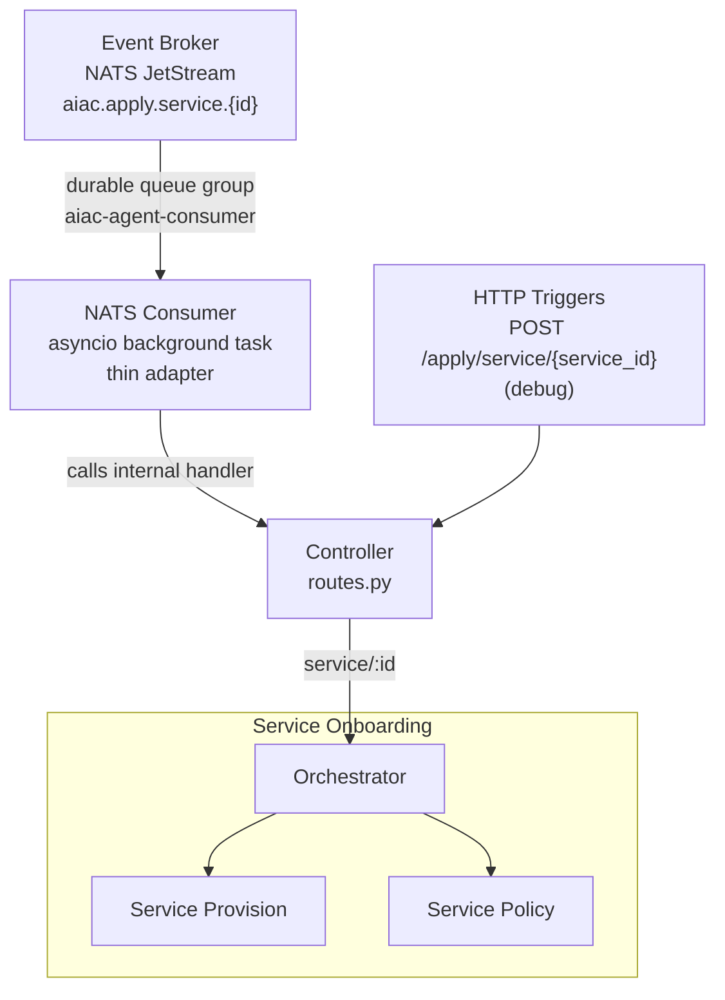
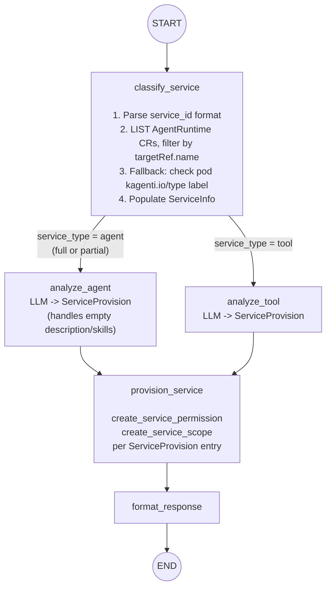
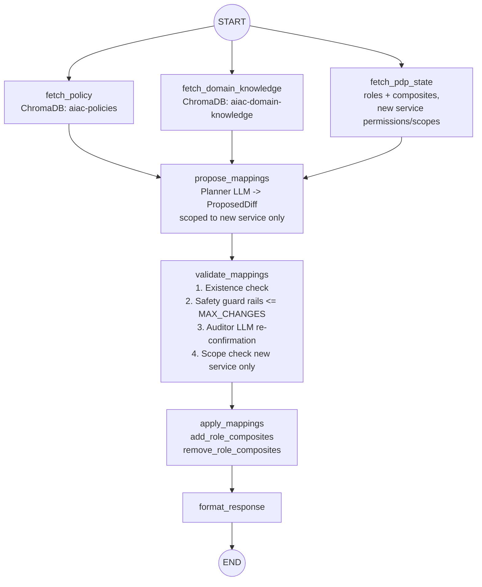

# UC1: Service Onboarding

## Depends on

- [`../aiac-agent.md`](../aiac-agent.md) — NATS Consumer, Controller, Shared Module (`BaseAgentState`, `PDPSnapshot`, `ProposedDiff`, `CompositeMapping`, `ValidationVerdict`), Validate Node common checks, Configuration, Error Handling, Runtime.

---

## Architecture



---

## Trigger(s)

| Source | Subject / Path |
|---|---|
| Event Broker (NATS) | `aiac.apply.service.{id}` (originated by Keycloak SPI `CLIENT_CREATED`) |
| HTTP (debug) | `POST /apply/service/{service_id}` |

---

## Orchestrator

`onboarding/orchestrator.py`

Sequences two sub-agents and assembles the combined response:

```
ServiceProvisionGraph.invoke() → ServicePolicyGraph.invoke() → assemble response
```

---

## Sub-agents

### Service Provision Sub-agent

`onboarding/provision/`

```
START → classify_service → [analyze_agent | analyze_tool] → provision_service → format_response → END
```

#### Graph



#### Nodes

- **`classify_service`**: determines service type and populates `ServiceInfo`.
  1. **Parse `trigger.service_id`**:
     - SPIFFE format `spiffe://{domain}/ns/{namespace}/sa/{serviceAccount}` → extract `namespace` and `workloadName = serviceAccount`. The SPIFFE service account name matches the workload name and the pod's `ServiceAccount` name 1:1 (confirmed against `spiffe://localtest.me/ns/team1/sa/git-issue-agent`).
     - Short format `{namespace}/{workloadName}` → split on first `/`.
     - Unrecognised format → treat as `ServiceType.tool`.
  2. **Look up `AgentRuntime` CR** (`agent.kagenti.dev/v1alpha1`) via the in-cluster Kubernetes API.
     - **Do not** GET by CR name — `AgentRuntime` CR names are user-chosen (e.g. `weather-agent-runtime`) and do not match the workload name. Instead, **LIST** all `AgentRuntime` CRs in the namespace and find the one whose `spec.targetRef.name == workloadName`.
     - **Found** → `service_type = agent`: find the corresponding `AgentCard` CR in the same namespace (also LIST, filter by `spec.targetRef.name == workloadName`); populate `ServiceInfo(service_type=agent, description=card.description, skills=[Skill(id, name, description) for each AgentSkill])`.
     - **Not found** → proceed to step 3 (legacy agent check).
  3. **Legacy agent check** (SPIFFE-format `service_id` only): if no `AgentRuntime` CR was found, look up the pod in the namespace whose `spec.serviceAccountName == workloadName`.
     - **Pod found with `kagenti.io/type: agent` label** → `service_type = agent` (legacy deployment pattern — no `AgentCard` available): populate `ServiceInfo(service_type=agent, description="", skills=[])`. This signals to downstream nodes that classification is partial.
     - **Pod not found or label absent** → `service_type = tool`: call `get_services(realm)` from `aiac.pdp.library.configuration`; locate the `Service` by `service_id`; populate `ServiceInfo(service_type=tool, description=service.description or service.name, skills=[])`.
  4. For short or unrecognised `service_id` formats, skip step 3 and go directly to the tool lookup in step 3's else branch.
  5. Returns `502` on Kubernetes API failure or if the `Service` record is not found for a tool.

  > **Kubernetes API access:** The agent pod `ServiceAccount` requires `get`/`list` on `agentruntimes.agent.kagenti.dev`, `agentcards.agent.kagenti.dev`, and `pods` (core API group) in the target namespace.

  > **AgentRuntime CR naming:** The CR name is user-chosen and does not match the workload. The workload is referenced via `spec.targetRef.name`. Always use a LIST + filter, never a GET by name.

  > **Two deployment patterns:** The kagenti-operator supports two patterns: (1) **AgentRuntime-managed** — an `AgentRuntime` CR is created first; the operator injects sidecars and creates an `AgentCard` CR automatically. (2) **Legacy label-based** — the deployment carries `kagenti.io/inject: enabled` and `kagenti.io/type: agent` labels directly; the operator injects sidecars but no `AgentRuntime` or `AgentCard` CR is created. Both patterns produce a running pod with `kagenti.io/type: agent` label (applied by the webhook); only the first produces structured `AgentCard` data. `classify_service` must handle both.

  > **`kagenti.io/type` label authority:** This label is applied exclusively by the kagenti-operator admission webhook, not by the workload itself. It is safe to treat as authoritative for service type classification when no `AgentRuntime` CR is present.

- **`analyze_agent`** / **`analyze_tool`**: LLM node producing a `ServiceProvision` from `ServiceInfo`. Routing is a conditional edge on `ServiceInfo.service_type`. `analyze_agent` must handle the partial-data case: when `ServiceInfo.description` is empty and `skills` is empty (legacy deployment, no `AgentCard`), the LLM should derive a minimal provision from the workload name alone rather than failing. The `ANALYZE_AGENT_SYSTEM` prompt must instruct the LLM to treat an empty description/skills list as "insufficient data — produce conservative minimal permissions only, and set `reasoning` to indicate the classification was partial".
- **`provision_service`**: non-LLM node; calls `create_service_permission` and `create_service_scope` from `aiac.pdp.library.policy` for each entry in `ServiceProvision`.
- **`format_response`**: assembles the provision result for the orchestrator.

#### State: `OnboardingProvisionState`

Extends `BaseAgentState` with:

| Field | Type | Description |
|---|---|---|
| `service_info` | `ServiceInfo \| None` | Populated by `classify_service` |
| `service_provision` | `ServiceProvision \| None` | Populated by `analyze_agent` or `analyze_tool` |

#### Types (`onboarding/provision/state.py`)

```python
class ServiceType(str, Enum):
    agent = "agent"
    tool = "tool"

class Skill(BaseModel):
    id: str
    name: str
    description: str

class ServiceInfo(BaseModel):
    service_type: ServiceType
    description: str
    skills: list[Skill] = []

class RoleDefinition(BaseModel):
    name: str
    description: str

class ScopeDefinition(BaseModel):
    name: str
    description: str

class ServiceProvision(BaseModel):
    roles: list[RoleDefinition]
    scopes: list[ScopeDefinition]
    reasoning: str

class OnboardingProvisionState(BaseAgentState):
    service_info: ServiceInfo | None = None
    service_provision: ServiceProvision | None = None
```

#### Prompts (`onboarding/provision/prompts.py`)

`ANALYZE_AGENT_SYSTEM`, `ANALYZE_TOOL_SYSTEM`

---

### Service Policy Sub-agent

`onboarding/policy/`

Runs after Service Provision completes. Freshly provisioned permissions/scopes are live in Keycloak before this sub-agent starts.

```
START → [fetch_policy ‖ fetch_domain_knowledge ‖ fetch_pdp_state] → propose_mappings → validate_mappings → apply_mappings → format_response → END
```

Examines all roles and determines which role → service permission/scope composite mappings to create for the newly added service, based on the access control policy and domain knowledge.

#### Nodes

- **`fetch_pdp_state`**: fetches all roles and their current composites, the new service's permissions and scopes.
- **`propose_mappings`**: LLM node; produces `ProposedDiff` scoped to the new service only.
- **`validate_mappings`**: existence check + safety guard rails + auditor LLM re-confirmation + scope check (bounded to the new service). See [Validate Node common checks](../aiac-agent.md#validate-node--common-checks-all-agents).
- **`apply_mappings`**: calls `add_role_composites` / `remove_role_composites` from `aiac.pdp.library.policy` for each entry in the validated diff.
- **`format_response`**: assembles the policy result for the orchestrator.

#### Graph



#### State

`BaseAgentState` (no extensions required).

#### Prompts (`onboarding/policy/prompts.py`)

`PLANNER_SYSTEM`, `AUDITOR_SYSTEM` — scoped to single-service composite mapping context.

---

## File Structure

```
aiac/src/aiac/agent/onboarding/
├── __init__.py
├── orchestrator.py                  ← sequences provision → policy, assembles combined response
├── provision/
│   ├── __init__.py
│   ├── graph.py                     ← Service Provision StateGraph
│   ├── nodes.py                     ← classify_service, analyze_agent, analyze_tool, provision_service, format_response
│   ├── prompts.py                   ← ANALYZE_AGENT_SYSTEM, ANALYZE_TOOL_SYSTEM
│   └── state.py                     ← ServiceType, Skill, ServiceInfo, RoleDefinition, ScopeDefinition, ServiceProvision, OnboardingProvisionState
└── policy/
    ├── __init__.py
    ├── graph.py                     ← Service Policy StateGraph
    ├── nodes.py                     ← fetch_pdp_state, propose_mappings, validate_mappings, apply_mappings, format_response
    └── prompts.py                   ← PLANNER_SYSTEM, AUDITOR_SYSTEM
```

---

## Open Questions

1. **`analyze_agent` with partial data — downstream quality**: When `ServiceInfo.description` and `skills` are both empty (legacy deployment), the LLM in `analyze_agent` produces conservative minimal permissions. Should the orchestrator surface a warning to the caller that the onboarding result is based on incomplete service metadata? Or is silent degraded output acceptable?

2. **AgentCard lookup for legacy pattern**: Once a legacy workload is migrated to the AgentRuntime-managed pattern (an `AgentRuntime` CR is created retroactively), the next trigger will find the CR and use full AgentCard data. No spec change needed, but the transition has no explicit re-onboarding trigger — is that acceptable, or should `classify_service` re-check and re-provision if it previously produced a partial result?
