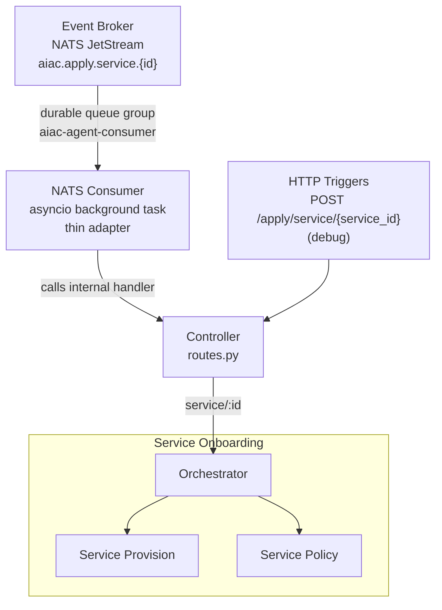
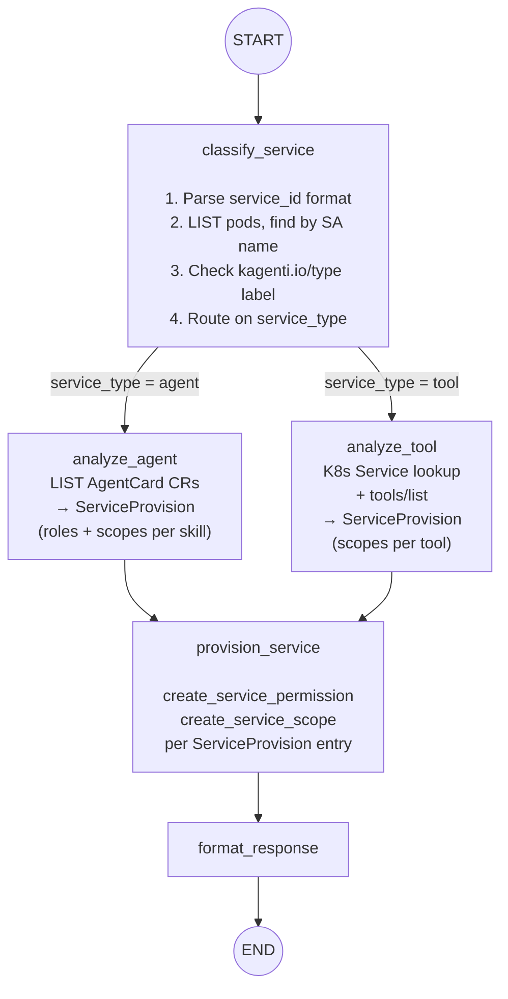
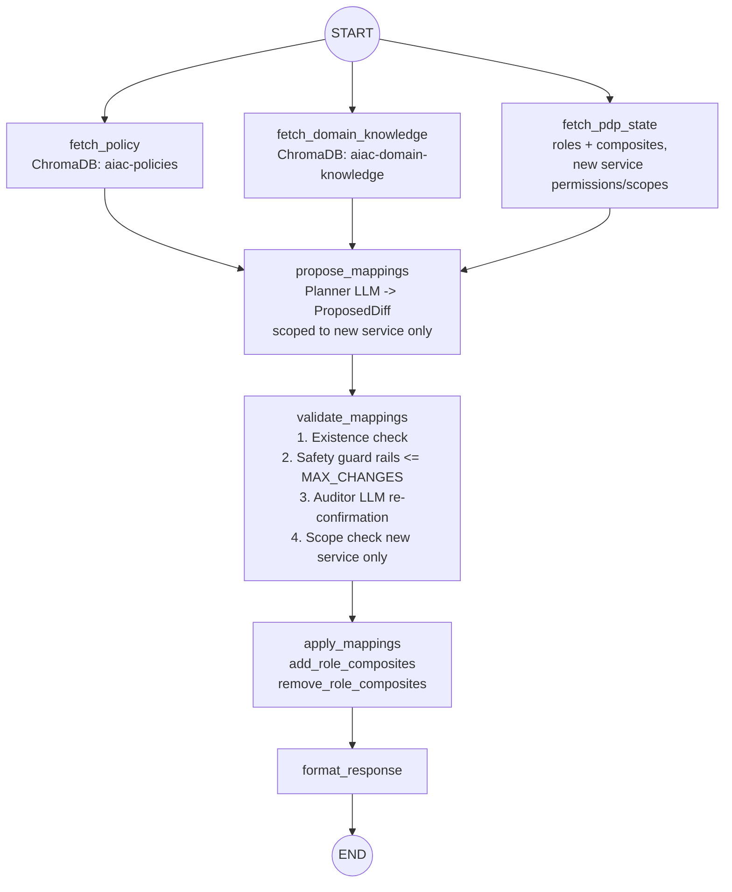

# UC1: Service Onboarding

## Depends on

- [`../aiac-agent.md`](../aiac-agent.md) — NATS Consumer, Controller, Shared Module (`BaseAgentState`, `PDPSnapshot`, `ProposedDiff`, `CompositeMapping`, `ValidationVerdict`), Validate Node common checks, Configuration, Error Handling, Runtime.

---

## Architecture



---

## Trigger(s)

| Source | Subject / Path |
|---|---|
| Event Broker (NATS) | `aiac.apply.service.{id}` (originated by Keycloak SPI `CLIENT_CREATED`) |
| HTTP (debug) | `POST /apply/service/{service_id}` |

---

## Orchestrator

`onboarding/orchestrator.py`

Sequences two sub-agents and assembles the combined response:

```
ServiceProvisionGraph.invoke() → ServicePolicyGraph.invoke() → assemble response
```

---

## Sub-agents

### Service Provision Sub-agent

`onboarding/provision/`

```
START → classify_service → [analyze_agent | analyze_tool] → provision_service → format_response → END
```

#### Graph



#### Nodes

- **`classify_service`**: determines service type only; does not populate `ServiceProvision`.
  1. **Parse `trigger.service_id`**:
     - SPIFFE format `spiffe://{domain}/ns/{namespace}/sa/{serviceAccount}` → extract `namespace` and `workloadName = serviceAccount`.
     - Short format `{namespace}/{workloadName}` → split on first `/`.
     - Unrecognised format → `service_type = tool`.
  2. **Find the pod**: LIST pods in `namespace`, find one whose `spec.serviceAccountName == workloadName`.
  3. **Check `kagenti.io/type` label** on the pod (applied exclusively by the kagenti-operator admission webhook — authoritative):
     - `kagenti.io/type: agent` → `service_type = agent`.
     - Label absent or any other value → `service_type = tool`.
  4. Routes to `analyze_agent` or `analyze_tool` on `service_type`. Returns `502` on Kubernetes API failure or if the pod is not found.

  > **Kubernetes API access:** Requires `get`/`list` on `pods` (core API group) in the target namespace.

  > **`kagenti.io/type` label authority:** Applied exclusively by the kagenti-operator admission webhook, not by the workload itself. Safe to treat as authoritative for service type classification.

- **`analyze_agent`**: non-LLM node; reads AgentCard CR and maps directly to `ServiceProvision`.
  1. LIST `AgentCard` CRs (`agent.kagenti.dev/v1alpha1`) in `namespace`; find the one whose `spec.targetRef.name == workloadName`.
  2. **AgentCard found** → produce `ServiceProvision`:
     - `roles`: `[RoleDefinition(name=f"{workloadName}.agent", description="Agent role")]`
     - `scopes`: `[ScopeDefinition(name=f"{workloadName}.{skill.name}", description=skill.description) for skill in card.skills]`
     - `reasoning`: `f"derived from AgentCard: {len(skills)} skills"`
  3. **AgentCard not found** (legacy deployment — operator injected sidecars via label only, no AgentCard CR created) → produce minimal `ServiceProvision`:
     - `roles`: `[RoleDefinition(name=f"{workloadName}.agent", description="Agent role")]`
     - `scopes`: `[ScopeDefinition(name=f"{workloadName}.access", description="Default access scope")]`
     - `reasoning`: `"partial: no AgentCard found, default scope assigned"`

  > **Kubernetes API access:** Requires `list` on `agentcards.agent.kagenti.dev` in the target namespace.

- **`analyze_tool`**: non-LLM node; discovers MCP tools via the tool's service endpoint and maps to `ServiceProvision`.
  1. LIST `v1/Services` in `namespace`; find the one whose `spec.selector` includes `app: {workloadName}`.
  2. Construct the MCP endpoint: `http://{service.name}.{namespace}.svc.cluster.local:{service.spec.ports[0].port}/mcp`
  3. Call `tools/list` (HTTP POST, MCP protocol) on that endpoint.
  4. Produce `ServiceProvision`:
     - `roles`: `[]` (tools are reactive — they do not initiate further calls)
     - `scopes`: `[ScopeDefinition(name=f"{workloadName}.{tool.name}", description=tool.description) for tool in manifest.tools]`
     - `reasoning`: `f"derived from MCP manifest: {len(tools)} tools"`
  5. Returns `502` on Kubernetes API failure, service not found, or MCP call failure.

  > **Kubernetes API access:** Requires `list` on `services` (core API group) in the target namespace.

  > **MCP path convention:** All MCP tool services in the kagenti platform must serve at `/mcp`.

- **`provision_service`**: non-LLM node; calls `create_service_permission` and `create_service_scope` from `aiac.pdp.library.policy` for each entry in `ServiceProvision`.
- **`format_response`**: assembles the provision result for the orchestrator.

#### State: `OnboardingProvisionState`

Extends `BaseAgentState` with:

| Field | Type | Description |
|---|---|---|
| `service_provision` | `ServiceProvision \| None` | Populated by `analyze_agent` or `analyze_tool` |

#### Types (`onboarding/provision/state.py`)

```python
class ServiceType(str, Enum):
    agent = "agent"
    tool = "tool"

class RoleDefinition(BaseModel):
    name: str
    description: str

class ScopeDefinition(BaseModel):
    name: str
    description: str

class ServiceProvision(BaseModel):
    roles: list[RoleDefinition]
    scopes: list[ScopeDefinition]
    reasoning: str  # machine-generated provenance string

class OnboardingProvisionState(BaseAgentState):
    service_provision: ServiceProvision | None = None
```

---

### Service Policy Sub-agent

`onboarding/policy/`

Runs after Service Provision completes. Freshly provisioned permissions/scopes are live in Keycloak before this sub-agent starts.

```
START → [fetch_policy ‖ fetch_domain_knowledge ‖ fetch_pdp_state] → propose_mappings → validate_mappings → apply_mappings → format_response → END
```

Examines all roles and determines which role → service permission/scope composite mappings to create for the newly added service, based on the access control policy and domain knowledge.

#### Nodes

- **`fetch_pdp_state`**: fetches all roles and their current composites, the new service's permissions and scopes.
- **`propose_mappings`**: LLM node; produces `ProposedDiff` scoped to the new service only.
- **`validate_mappings`**: existence check + safety guard rails + auditor LLM re-confirmation + scope check (bounded to the new service). See [Validate Node common checks](../aiac-agent.md#validate-node--common-checks-all-agents).
- **`apply_mappings`**: calls `add_role_composites` / `remove_role_composites` from `aiac.pdp.library.policy` for each entry in the validated diff.
- **`format_response`**: assembles the policy result for the orchestrator.

#### Graph



#### State

`BaseAgentState` (no extensions required).

#### Prompts (`onboarding/policy/prompts.py`)

`PLANNER_SYSTEM`, `AUDITOR_SYSTEM` — scoped to single-service composite mapping context.

---

## File Structure

```
aiac/src/aiac/agent/onboarding/
├── __init__.py
├── orchestrator.py                  ← sequences provision → policy, assembles combined response
├── provision/
│   ├── __init__.py
│   ├── graph.py                     ← Service Provision StateGraph
│   ├── nodes.py                     ← classify_service, analyze_agent, analyze_tool, provision_service, format_response
│   └── state.py                     ← ServiceType, RoleDefinition, ScopeDefinition, ServiceProvision, OnboardingProvisionState
└── policy/
    ├── __init__.py
    ├── graph.py                     ← Service Policy StateGraph
    ├── nodes.py                     ← fetch_pdp_state, propose_mappings, validate_mappings, apply_mappings, format_response
    └── prompts.py                   ← PLANNER_SYSTEM, AUDITOR_SYSTEM
```

