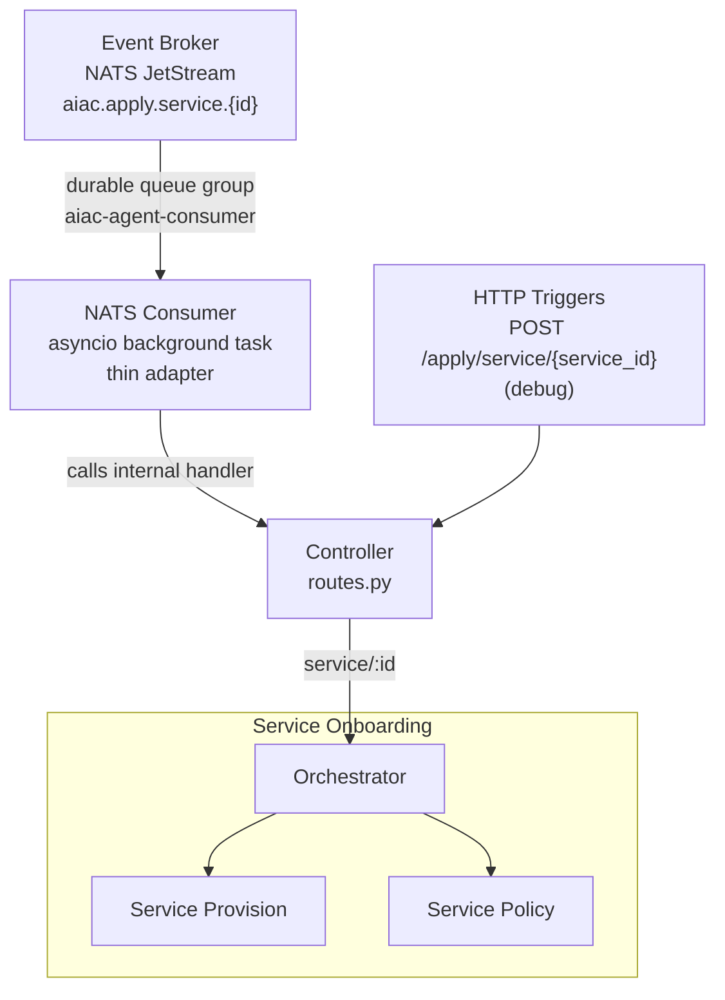
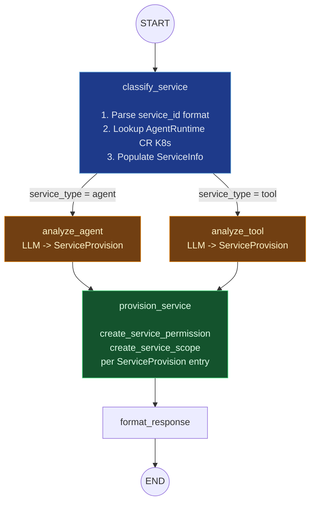
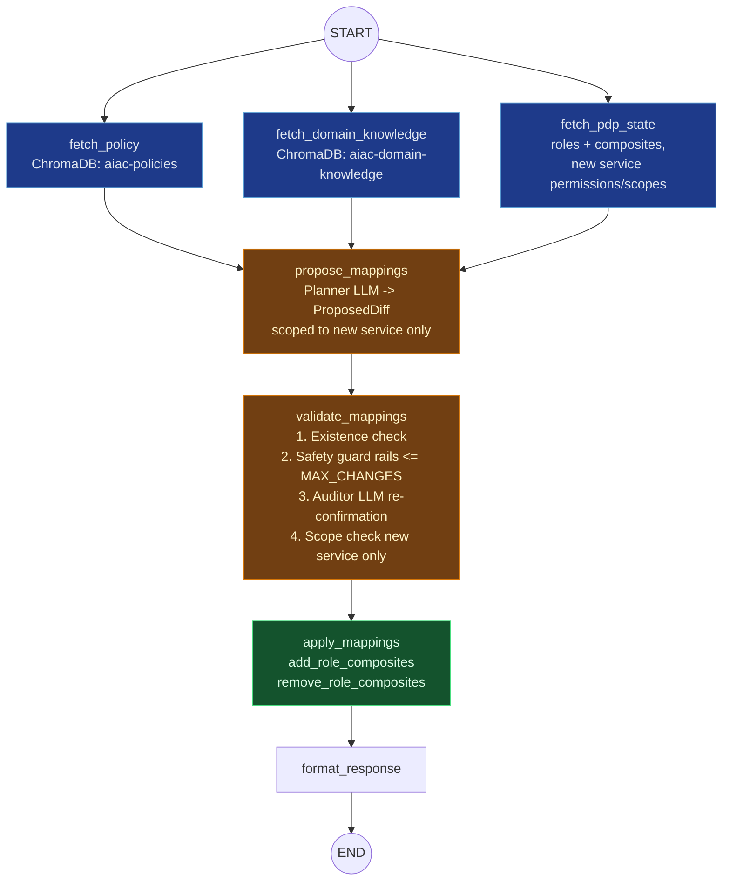

# UC1: Service Onboarding

## Depends on

- [`../aiac-agent.md`](../aiac-agent.md) — NATS Consumer, Controller, Shared Module (`BaseAgentState`, `PDPSnapshot`, `ProposedDiff`, `CompositeMapping`, `ValidationVerdict`), Validate Node common checks, Configuration, Error Handling, Runtime.

---

## Architecture



---

## Trigger(s)

| Source | Subject / Path |
|---|---|
| Event Broker (NATS) | `aiac.apply.service.{id}` (originated by Keycloak SPI `CLIENT_CREATED`) |
| HTTP (debug) | `POST /apply/service/{service_id}` |

---

## Orchestrator

`onboarding/orchestrator.py`

Sequences two sub-agents and assembles the combined response:

```
ServiceProvisionGraph.invoke() → ServicePolicyGraph.invoke() → assemble response
```

---

## Sub-agents

### Service Provision Sub-agent

`onboarding/provision/`

```
START → classify_service → [analyze_agent | analyze_tool] → provision_service → format_response → END
```

#### Graph



#### Nodes

- **`classify_service`**: determines service type and populates `ServiceInfo`.
  1. **Parse `trigger.service_id`**:
     - SPIFFE format `spiffe://{domain}/ns/{namespace}/sa/{serviceAccount}` → extract namespace.
     - Short format `{namespace}/{workloadName}` → split on first `/`.
     - Unrecognised format → treat as `ServiceType.tool`.
  2. **Look up `AgentRuntime` CR** (`agent.kagenti.dev/v1alpha1`) by namespace + name via the in-cluster Kubernetes API.
     - **Found** → `service_type = agent`: read the `AgentCard` CR; populate `ServiceInfo(service_type=agent, description=card.description, skills=[Skill(id, name, description) for each AgentSkill])`.
     - **Not found** → `service_type = tool`: call `get_services(realm)` from `aiac.pdp.library.configuration`; locate the `Service` by `service_id`; populate `ServiceInfo(service_type=tool, description=service.description or service.name, skills=[])`.
  3. Returns `502` on Kubernetes API failure or if the Service record is not found for a tool.

  > **Kubernetes API access:** The agent pod `ServiceAccount` requires `get`/`list` on `agentruntimes.agent.kagenti.dev` and `agentcards.agent.kagenti.dev`.

  > **kagenti-operator note:** The operator does not expose an HTTP API. `AgentCard` CRs (`agent.kagenti.dev/v1alpha1`) are stored alongside workloads. Absence of an `AgentRuntime` CR is the authoritative signal for `ServiceType.tool`.

- **`analyze_agent`** / **`analyze_tool`**: LLM node producing a `ServiceProvision` from `ServiceInfo`. Routing is a conditional edge on `ServiceInfo.service_type`.
- **`provision_service`**: non-LLM node; calls `create_service_permission` and `create_service_scope` from `aiac.pdp.library.policy` for each entry in `ServiceProvision`.
- **`format_response`**: assembles the provision result for the orchestrator.

#### State: `OnboardingProvisionState`

Extends `BaseAgentState` with:

| Field | Type | Description |
|---|---|---|
| `service_info` | `ServiceInfo \| None` | Populated by `classify_service` |
| `service_provision` | `ServiceProvision \| None` | Populated by `analyze_agent` or `analyze_tool` |

#### Types (`onboarding/provision/state.py`)

```python
class ServiceType(str, Enum):
    agent = "agent"
    tool = "tool"

class Skill(BaseModel):
    id: str
    name: str
    description: str

class ServiceInfo(BaseModel):
    service_type: ServiceType
    description: str
    skills: list[Skill] = []

class RoleDefinition(BaseModel):
    name: str
    description: str

class ScopeDefinition(BaseModel):
    name: str
    description: str

class ServiceProvision(BaseModel):
    roles: list[RoleDefinition]
    scopes: list[ScopeDefinition]
    reasoning: str

class OnboardingProvisionState(BaseAgentState):
    service_info: ServiceInfo | None = None
    service_provision: ServiceProvision | None = None
```

#### Prompts (`onboarding/provision/prompts.py`)

`ANALYZE_AGENT_SYSTEM`, `ANALYZE_TOOL_SYSTEM`

---

### Service Policy Sub-agent

`onboarding/policy/`

Runs after Service Provision completes. Freshly provisioned permissions/scopes are live in Keycloak before this sub-agent starts.

```
START → [fetch_policy ‖ fetch_domain_knowledge ‖ fetch_pdp_state] → propose_mappings → validate_mappings → apply_mappings → format_response → END
```

Examines all roles and determines which role → service permission/scope composite mappings to create for the newly added service, based on the access control policy and domain knowledge.

#### Nodes

- **`fetch_pdp_state`**: fetches all roles and their current composites, the new service's permissions and scopes.
- **`propose_mappings`**: LLM node; produces `ProposedDiff` scoped to the new service only.
- **`validate_mappings`**: existence check + safety guard rails + auditor LLM re-confirmation + scope check (bounded to the new service). See [Validate Node common checks](../aiac-agent.md#validate-node--common-checks-all-agents).
- **`apply_mappings`**: calls `add_role_composites` / `remove_role_composites` from `aiac.pdp.library.policy` for each entry in the validated diff.
- **`format_response`**: assembles the policy result for the orchestrator.

#### Graph



#### State

`BaseAgentState` (no extensions required).

#### Prompts (`onboarding/policy/prompts.py`)

`PLANNER_SYSTEM`, `AUDITOR_SYSTEM` — scoped to single-service composite mapping context.

---

## File Structure

```
aiac/src/aiac/agent/onboarding/
├── __init__.py
├── orchestrator.py                  ← sequences provision → policy, assembles combined response
├── provision/
│   ├── __init__.py
│   ├── graph.py                     ← Service Provision StateGraph
│   ├── nodes.py                     ← classify_service, analyze_agent, analyze_tool, provision_service, format_response
│   ├── prompts.py                   ← ANALYZE_AGENT_SYSTEM, ANALYZE_TOOL_SYSTEM
│   └── state.py                     ← ServiceType, Skill, ServiceInfo, RoleDefinition, ScopeDefinition, ServiceProvision, OnboardingProvisionState
└── policy/
    ├── __init__.py
    ├── graph.py                     ← Service Policy StateGraph
    ├── nodes.py                     ← fetch_pdp_state, propose_mappings, validate_mappings, apply_mappings, format_response
    └── prompts.py                   ← PLANNER_SYSTEM, AUDITOR_SYSTEM
```

---

## Open Questions

_None currently._
