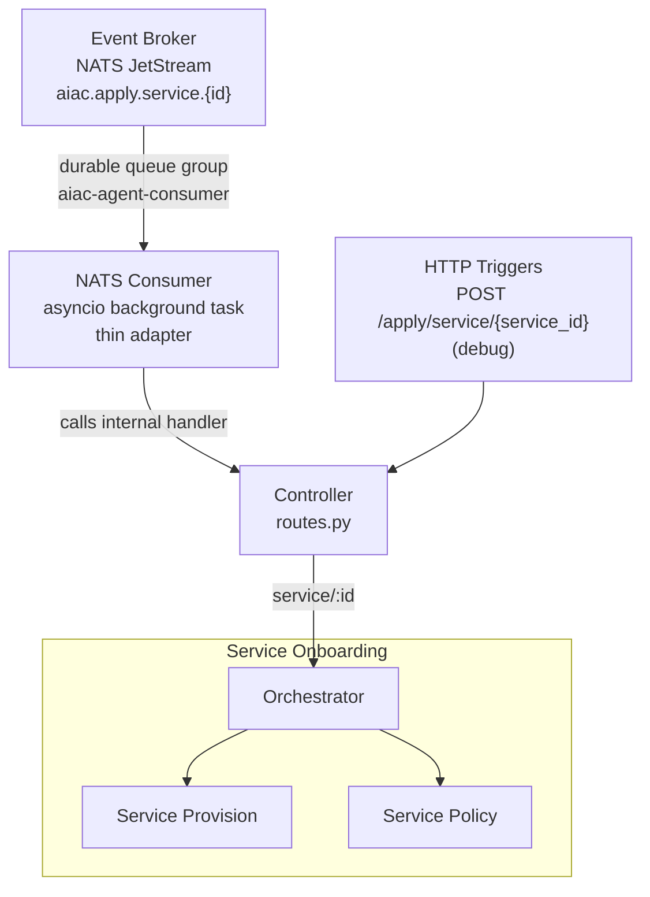
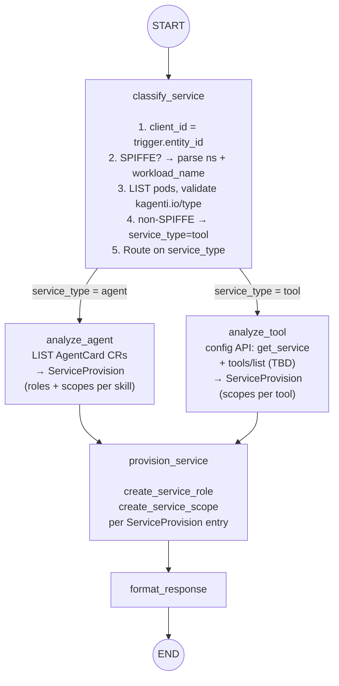
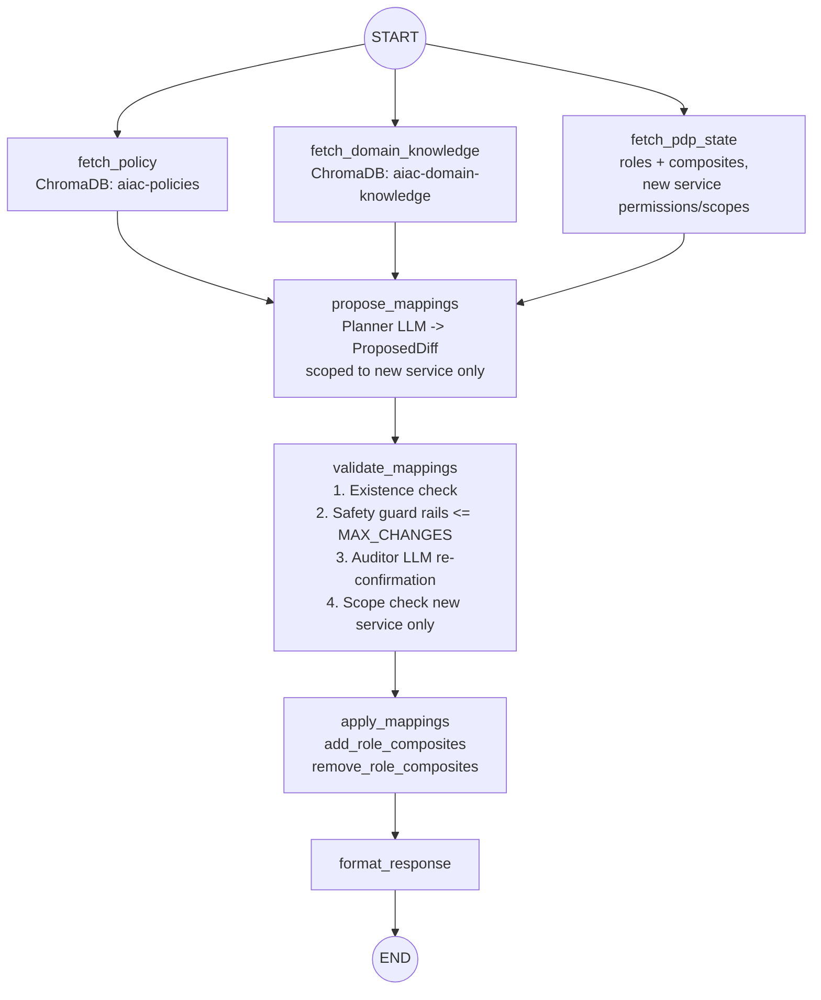

# UC1: Service Onboarding

## Depends on

- [`../aiac-agent.md`](../aiac-agent.md) — NATS Consumer, Controller, Shared Module (`BaseAgentState`, `PDPSnapshot`, `ProposedDiff`, `CompositeMapping`, `ValidationVerdict`), Validate Node common checks, Configuration, Error Handling, Runtime.

---

## Architecture



---

## Trigger(s)

| Source | Subject / Path |
|---|---|
| Event Broker (NATS) | `aiac.apply.service.{id}` (originated by Keycloak SPI `CLIENT_CREATED`) |
| HTTP (debug) | `POST /apply/service/{service_id}` |

---

## Orchestrator

`onboarding/orchestrator.py`

Sequences two sub-agents and assembles the combined response:

```
ServiceProvisionGraph.invoke() → ServicePolicyGraph.invoke() → assemble response
```

---

## Sub-agents

### Service Provision Sub-agent

`onboarding/provision/`

```
START → classify_service → [analyze_agent | analyze_tool] → provision_service → format_response → END
```

#### Graph



#### Nodes

- **`classify_service`**: determines service type; stores parsed coordinates in state; does not populate `ServiceProvision`.
  1. **Store `client_id`**: `state.client_id = trigger.entity_id` (the Keycloak `client_id` as received — the NATS payload carries `{ "id": "<entity-id>" }` which is the Keycloak `client_id`).
  2. **Check format**:
     - **SPIFFE format** `spiffe://{domain}/ns/{namespace}/sa/{serviceAccount}` → extract `namespace` and `workload_name = serviceAccount`; store both in state; continue to step 3.
     - **Any other format** → `state.service_type = tool`; `state.namespace = None`; `state.workload_name = None`; route to `analyze_tool`. No K8s access.
  3. **Find the pod** (SPIFFE path only): LIST pods in `namespace`, find one whose `spec.serviceAccountName == workload_name`. Returns `502` on Kubernetes API failure or if pod not found.
  4. **Validate `kagenti.io/type` label** (SPIFFE path only) on the pod (applied exclusively by the kagenti-operator admission webhook):
     - `kagenti.io/type: agent` → `state.service_type = agent`; route to `analyze_agent`.
     - Label absent or any other value → returns `502` (SPIFFE ID registered in Keycloak without operator label is an inconsistent deployment — surface as error rather than mis-classify).

  > **Kubernetes API access:** Requires `list` on `pods` (core API group) in the target namespace. Agent path only — tool path performs no K8s access.

  > **`kagenti.io/type` label authority:** Applied exclusively by the kagenti-operator admission webhook, not by the workload itself. Safe to treat as authoritative for service type classification.

- **`analyze_agent`**: non-LLM node; reads AgentCard CR and maps directly to `ServiceProvision`.
  1. LIST `AgentCard` CRs (`agent.kagenti.dev/v1alpha1`) in `namespace`; find the one whose `spec.targetRef.name == workloadName`.
  2. **AgentCard found** → produce `ServiceProvision`:
     - `roles`: `[RoleDefinition(name=f"{workloadName}.agent", description="Agent role")]`
     - `scopes`: `[ScopeDefinition(name=f"{workloadName}.{skill.name}", description=skill.description) for skill in card.skills]`
     - `reasoning`: `f"derived from AgentCard: {len(skills)} skills"`
  3. **AgentCard not found** (legacy deployment — operator injected sidecars via label only, no AgentCard CR created) → produce minimal `ServiceProvision`:
     - `roles`: `[RoleDefinition(name=f"{workloadName}.agent", description="Agent role")]`
     - `scopes`: `[ScopeDefinition(name=f"{workloadName}.access", description="Default access scope")]`
     - `reasoning`: `"partial: no AgentCard found, default scope assigned"`

  > **Kubernetes API access:** Requires `list` on `agentcards.agent.kagenti.dev` in the target namespace.

- **`analyze_tool`**: non-LLM node; discovers MCP tools and maps to `ServiceProvision`.

  1. **Resolve `workload_name`**: call `get_service(client_id)` from `aiac.pdp.library.configuration` → `state.workload_name = client.name`. No K8s access.
  2. **Locate MCP endpoint**: **TBD** — how `analyze_tool` reaches the MCP endpoint is unresolved. See issue [6.2](../../../issues/6.2-analyze-tool-lookup-strategy.md). Steps 3–4 depend on this being resolved.
  3. Call `tools/list` (HTTP POST, MCP protocol) on the resolved endpoint.
  4. Produce `ServiceProvision`:
     - `roles`: `[]` (tools are reactive — they do not initiate further calls)
     - `scopes`: `[ScopeDefinition(name=f"{workload_name}.{tool.name}", description=tool.description) for tool in manifest.tools]`
     - `reasoning`: `f"derived from MCP manifest: {len(tools)} tools"`
  5. Returns `502` on config API failure, endpoint lookup failure, or MCP call failure.

  > **Kubernetes API access:** None — tool path uses config API only (pending issue 6.2 resolution).

  > **MCP path convention:** All MCP tool services in the kagenti platform must serve at `/mcp`.

- **`provision_service`**: non-LLM node; calls `create_service_role(client_id, role)` and `create_service_scope(client_id, scope)` from `aiac.pdp.library.policy` for each entry in `ServiceProvision`. Reads `client_id` from state.
- **`format_response`**: assembles the provision result for the orchestrator.

#### State: `OnboardingProvisionState`

Extends `BaseAgentState` with:

| Field | Type | Description |
|---|---|---|
| `client_id` | `str \| None` | Keycloak `client_id` = `trigger.entity_id`; set by `classify_service` |
| `namespace` | `str \| None` | Parsed from SPIFFE URI; set by `classify_service` for agents; `None` for tools |
| `workload_name` | `str \| None` | Parsed from SPIFFE URI (agents) or `client.name` from config API (tools); set by `classify_service` or `analyze_tool` |
| `service_type` | `ServiceType \| None` | `agent` or `tool`; set by `classify_service`; used by conditional edge routing |
| `service_provision` | `ServiceProvision \| None` | Populated by `analyze_agent` or `analyze_tool` |

#### Types (`onboarding/provision/state.py`)

```python
class ServiceType(str, Enum):
    agent = "agent"
    tool = "tool"

class RoleDefinition(BaseModel):
    name: str
    description: str

class ScopeDefinition(BaseModel):
    name: str
    description: str

class ServiceProvision(BaseModel):
    roles: list[RoleDefinition]
    scopes: list[ScopeDefinition]
    reasoning: str  # machine-generated provenance string

class OnboardingProvisionState(BaseAgentState):
    client_id: str | None = None          # Keycloak client_id = trigger.entity_id
    namespace: str | None = None          # agents only; None for tools
    workload_name: str | None = None      # agents: from SPIFFE; tools: client.name via config API
    service_type: ServiceType | None = None  # routing field; set by classify_service
    service_provision: ServiceProvision | None = None
```

---

### Service Policy Sub-agent

`onboarding/policy/`

Runs after Service Provision completes. Freshly provisioned permissions/scopes are live in Keycloak before this sub-agent starts.

```
START → [fetch_policy ‖ fetch_domain_knowledge ‖ fetch_pdp_state] → propose_mappings → validate_mappings → apply_mappings → format_response → END
```

Examines all roles and determines which role → service permission/scope composite mappings to create for the newly added service, based on the access control policy and domain knowledge.

#### Nodes

- **`fetch_pdp_state`**: fetches all roles and their current composites, the new service's permissions and scopes.
- **`propose_mappings`**: LLM node; produces `ProposedDiff` scoped to the new service only.
- **`validate_mappings`**: existence check + safety guard rails + auditor LLM re-confirmation + scope check (bounded to the new service). See [Validate Node common checks](../aiac-agent.md#validate-node--common-checks-all-agents).
- **`apply_mappings`**: calls `add_role_composites` / `remove_role_composites` from `aiac.pdp.library.policy` for each entry in the validated diff.
- **`format_response`**: assembles the policy result for the orchestrator.

#### Graph



#### State

`BaseAgentState` (no extensions required).

#### Prompts (`onboarding/policy/prompts.py`)

`PLANNER_SYSTEM`, `AUDITOR_SYSTEM` — scoped to single-service composite mapping context.

---

## File Structure

```
aiac/src/aiac/agent/onboarding/
├── __init__.py
├── orchestrator.py                  ← sequences provision → policy, assembles combined response
├── provision/
│   ├── __init__.py
│   ├── graph.py                     ← Service Provision StateGraph
│   ├── nodes.py                     ← classify_service, analyze_agent, analyze_tool, provision_service, format_response
│   └── state.py                     ← ServiceType, RoleDefinition, ScopeDefinition, ServiceProvision, OnboardingProvisionState
└── policy/
    ├── __init__.py
    ├── graph.py                     ← Service Policy StateGraph
    ├── nodes.py                     ← fetch_pdp_state, propose_mappings, validate_mappings, apply_mappings, format_response
    └── prompts.py                   ← PLANNER_SYSTEM, AUDITOR_SYSTEM
```

