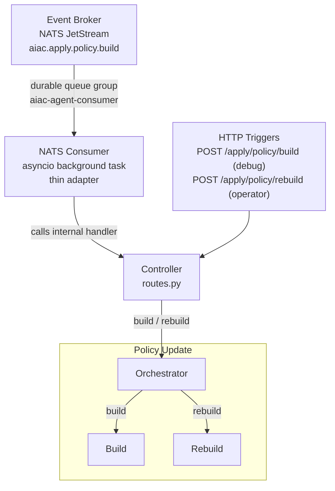
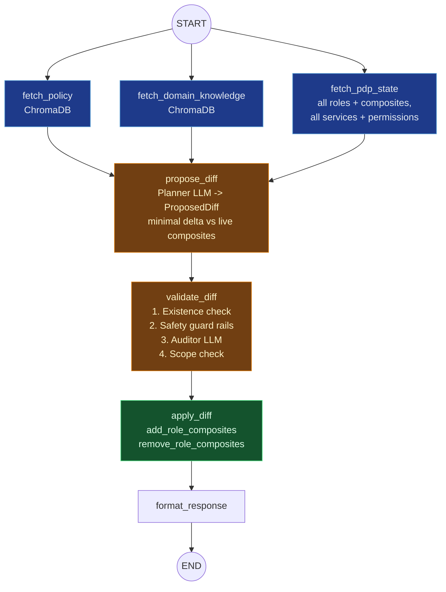
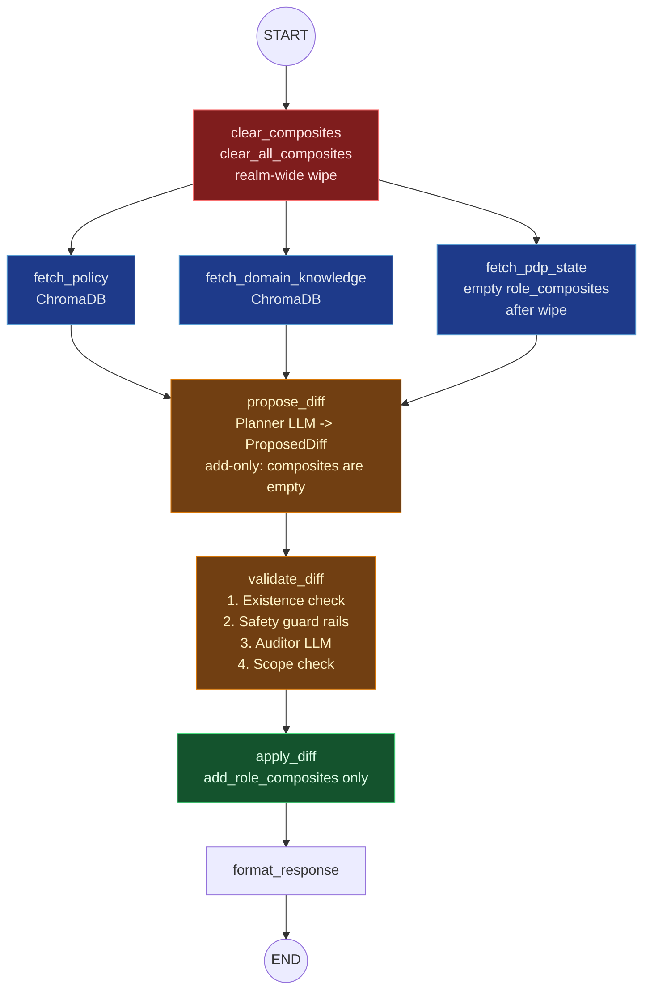

# UC2: Policy Update

## Depends on

- [`../aiac-agent.md`](../aiac-agent.md) — NATS Consumer, Controller, Shared Module, Validate Node common checks, Configuration, Error Handling, Runtime.

---

## Architecture



---

## Trigger(s)

| Source | Subject / Path | Sub-agent |
|---|---|---|
| Event Broker (NATS) | `aiac.apply.policy.build` (originated by RAG Ingest Service post-ingest) | Build |
| HTTP (operator only) | `POST /apply/policy/rebuild` (via `kubectl port-forward`) | Rebuild |
| HTTP (debug) | `POST /apply/policy/build` | Build |

---

## Orchestrator

`policy_update/orchestrator.py`

Dispatches to one sub-agent based on trigger type:
- `build` trigger → Build sub-agent
- `rebuild` trigger → Rebuild sub-agent

The Policy Update agent compares the **current composite role mappings** (authoritative record of previously applied rules) against the **current policy in ChromaDB** and applies the delta: adding missing composite mappings and removing stale ones.

---

## Sub-agents

### Build Sub-agent

`policy_update/build/`

```
START → [fetch_policy ‖ fetch_domain_knowledge ‖ fetch_pdp_state] → propose_diff → validate_diff → apply_diff → format_response → END
```

#### Nodes

- **`fetch_pdp_state`**: fetches all roles and their current composites, all services and their permissions, all scopes.
- **`propose_diff`**: LLM node; produces `ProposedDiff` — minimal delta between ChromaDB policy and live composite state.
- **`validate_diff`**: existence check + safety guard rails + auditor LLM re-confirmation + scope check. See [Validate Node common checks](../aiac-agent.md#validate-node--common-checks-all-agents).
- **`apply_diff`**: calls `add_role_composites` / `remove_role_composites` from `aiac.pdp.library.policy`.
- **`format_response`**: assembles the build result.

#### Graph



#### State

`BaseAgentState` (no extensions required).

#### Prompts (`policy_update/build/prompts.py`)

`PLANNER_SYSTEM`, `AUDITOR_SYSTEM`.

---

### Rebuild Sub-agent

`policy_update/rebuild/`

Identical to the Build sub-agent with one addition: a `clear_composites` node prepended before the fetch fan-out.

```
START → clear_composites → [fetch_policy ‖ fetch_domain_knowledge ‖ fetch_pdp_state] → propose_diff → validate_diff → apply_diff → format_response → END
```

#### Delta from Build

- **`clear_composites`**: calls `clear_all_composites(realm)` from `aiac.pdp.library.policy` before the fetch fan-out. Removes all composite mappings from all roles.
- **`fetch_pdp_state`**: receives a `PDPSnapshot` with empty `role_composites` after the wipe.
- **`propose_diff`**: produces an add-only diff (no removals — composites are empty).
- All remaining nodes (`validate_diff`, `apply_diff`, `format_response`): identical contract to Build.

#### Graph



#### State

`BaseAgentState` (no extensions required).

#### Prompts (`policy_update/rebuild/prompts.py`)

`PLANNER_SYSTEM`, `AUDITOR_SYSTEM`.

---

## Response

**Success:**
```json
{ "added": [...], "removed": [...], "summary": "...", "provisioned": null }
```

**Abort (validation failure):**
```json
{ "added": [], "removed": [], "summary": "...", "validation_errors": [...], "provisioned": null }
```

---

## File Structure

```
aiac/src/aiac/agent/policy_update/
├── __init__.py
├── orchestrator.py                  ← dispatches to build or rebuild sub-agent
├── build/
│   ├── __init__.py
│   ├── graph.py                     ← Build StateGraph
│   ├── nodes.py                     ← fetch_pdp_state, propose_diff, validate_diff, apply_diff, format_response
│   └── prompts.py                   ← PLANNER_SYSTEM, AUDITOR_SYSTEM
└── rebuild/
    ├── __init__.py
    ├── graph.py                     ← Rebuild StateGraph
    ├── nodes.py                     ← clear_composites, fetch_pdp_state, propose_diff, validate_diff, apply_diff, format_response
    └── prompts.py                   ← PLANNER_SYSTEM, AUDITOR_SYSTEM
```

---

## Open Questions

_None currently._
