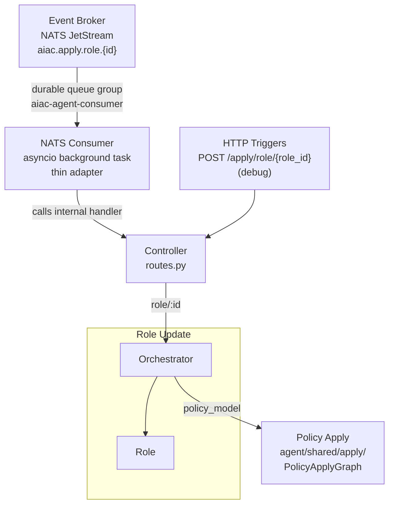
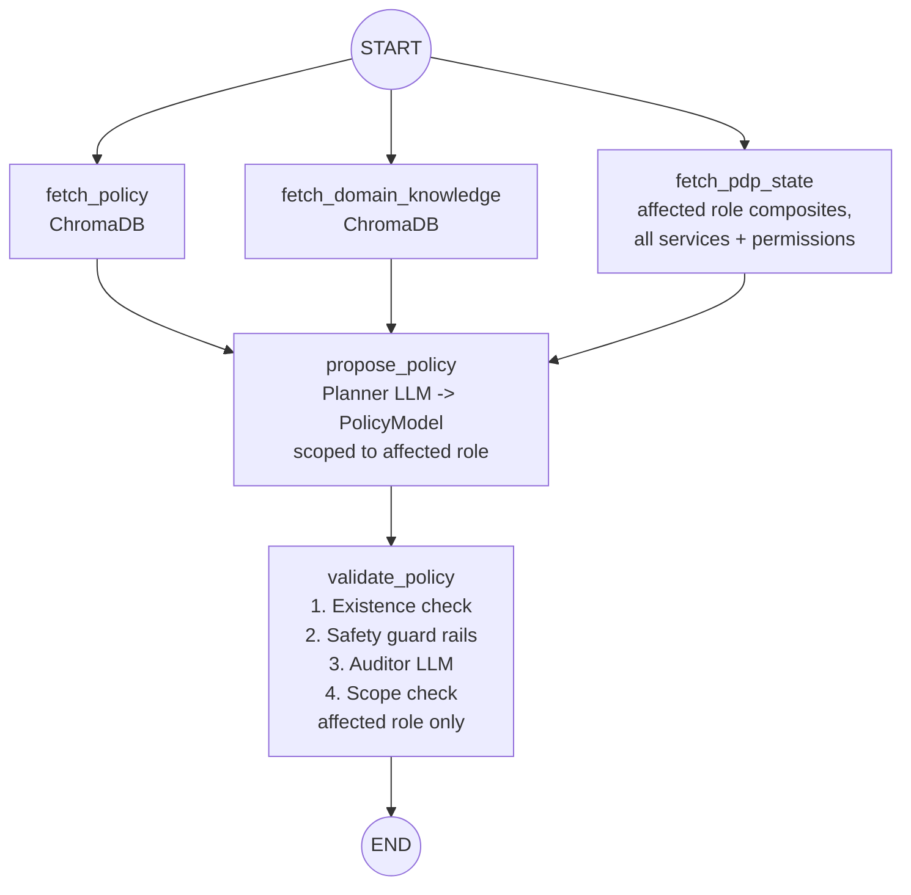

# UC3: Role Update

## Depends on

- [`../aiac-agent.md`](../aiac-agent.md) — NATS Consumer, Controller, Shared Module, Validate Node common checks, Configuration, Error Handling, Runtime.

---

## Architecture



---

## Trigger(s)

| Source | Subject / Path |
|---|---|
| Event Broker (NATS) | `aiac.apply.role.{id}` (originated by Keycloak SPI role created/updated) |
| HTTP (debug) | `POST /apply/role/{role_id}` |

---

## Orchestrator

`roles/orchestrator.py`

Dispatches to the Role sub-agent, then sequences `PolicyApplyGraph` (see [Shared Module: `shared/apply/`](../aiac-agent.md#sharedapply)):

- Role sub-agent → Policy Apply

If the sub-agent's `validate_policy` fails (`policy_model is None`), the orchestrator returns the abort response directly without calling `PolicyApplyGraph`.

---

## Sub-agents

### Role Sub-agent

`roles/role/`

```
START → [fetch_policy ‖ fetch_domain_knowledge ‖ fetch_pdp_state] → propose_policy → validate_policy → END
```

#### Nodes

- **`fetch_pdp_state`**: fetches all services and their permissions, all roles, and the current composites for the affected role.
- **`propose_policy`**: LLM node; produces `PolicyModel` scoped to the affected role. `PolicyModel` is defined in `aiac/pdp/library/policy/models.py` (see [`../aiac-agent.md`](../aiac-agent.md)).
- **`validate_policy`**: existence check + safety guard rails + auditor LLM re-confirmation + scope check (bounded to the affected role). See [Validate Node common checks](../aiac-agent.md#validate-node--common-checks-all-agents). Writes `policy_model` to state on success; leaves it `None` on failure.

#### Graph



#### State

`BaseAgentState` (no extensions required).

#### Prompts (`roles/role/prompts.py`)

`PLANNER_SYSTEM`, `AUDITOR_SYSTEM`.

---

## Response

**Success:**
```json
{ "added": [...], "removed": [...], "summary": "...", "provisioned": null }
```

**Abort (validation failure):**
```json
{ "added": [], "removed": [], "summary": "...", "validation_errors": [...], "provisioned": null }
```

---

## File Structure

```
aiac/src/aiac/agent/roles/
├── __init__.py
├── orchestrator.py                  ← dispatches to role sub-agent, then sequences PolicyApplyGraph
└── role/
    ├── __init__.py
    ├── graph.py                     ← Role StateGraph
    ├── nodes.py                     ← fetch_pdp_state, propose_policy, validate_policy
    └── prompts.py                   ← PLANNER_SYSTEM, AUDITOR_SYSTEM
```

---

## Open Questions

_None currently._
