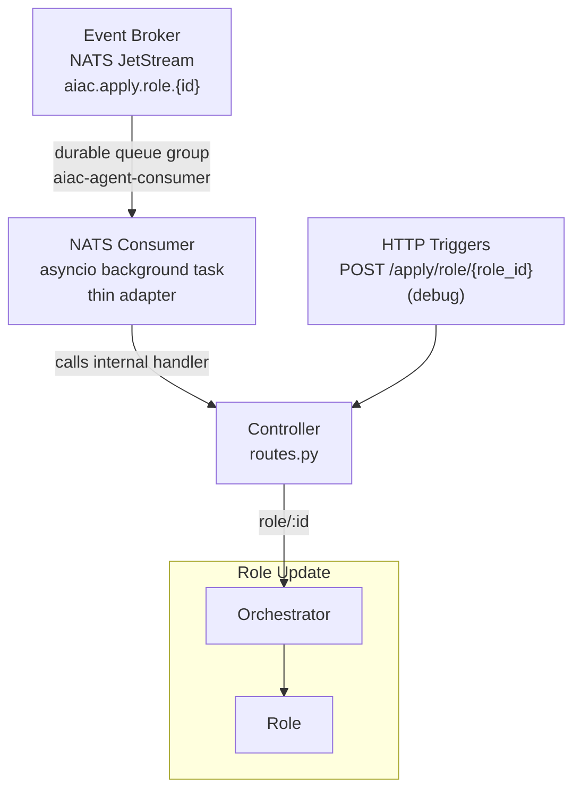
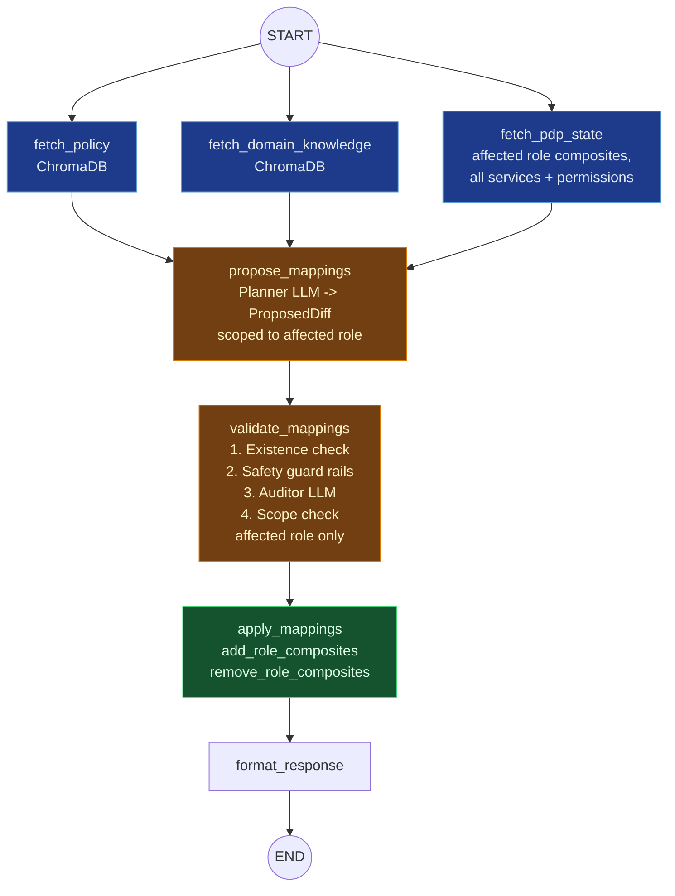

# UC3: Role Update

## Depends on

- [`../aiac-agent.md`](../aiac-agent.md) — NATS Consumer, Controller, Shared Module, Validate Node common checks, Configuration, Error Handling, Runtime.

---

## Architecture



---

## Trigger(s)

| Source | Subject / Path |
|---|---|
| Event Broker (NATS) | `aiac.apply.role.{id}` (originated by Keycloak SPI role created/updated) |
| HTTP (debug) | `POST /apply/role/{role_id}` |

---

## Orchestrator

`roles/orchestrator.py`

Dispatches to the Role sub-agent.

---

## Sub-agents

### Role Sub-agent

`roles/role/`

```
START → [fetch_policy ‖ fetch_domain_knowledge ‖ fetch_pdp_state] → propose_mappings → validate_mappings → apply_mappings → format_response → END
```

#### Nodes

- **`fetch_pdp_state`**: fetches all services and their permissions, all roles, and the current composites for the affected role.
- **`propose_mappings`**: LLM node; produces `ProposedDiff` scoped to the affected role.
- **`validate_mappings`**: existence check + safety guard rails + auditor LLM re-confirmation + scope check (bounded to the affected role). See [Validate Node common checks](../aiac-agent.md#validate-node--common-checks-all-agents).
- **`apply_mappings`**: calls `add_role_composites` / `remove_role_composites` from `aiac.pdp.library.policy`.
- **`format_response`**: assembles the result.

#### Graph



#### State

`BaseAgentState` (no extensions required).

#### Prompts (`roles/role/prompts.py`)

`PLANNER_SYSTEM`, `AUDITOR_SYSTEM`.

---

## Response

**Success:**
```json
{ "added": [...], "removed": [...], "summary": "...", "provisioned": null }
```

**Abort (validation failure):**
```json
{ "added": [], "removed": [], "summary": "...", "validation_errors": [...], "provisioned": null }
```

---

## File Structure

```
aiac/src/aiac/agent/roles/
├── __init__.py
├── orchestrator.py                  ← dispatches to role sub-agent
└── role/
    ├── __init__.py
    ├── graph.py                     ← Role StateGraph
    ├── nodes.py                     ← fetch_pdp_state, propose_mappings, validate_mappings, apply_mappings, format_response
    └── prompts.py                   ← PLANNER_SYSTEM, AUDITOR_SYSTEM
```

---

## Open Questions

_None currently._
